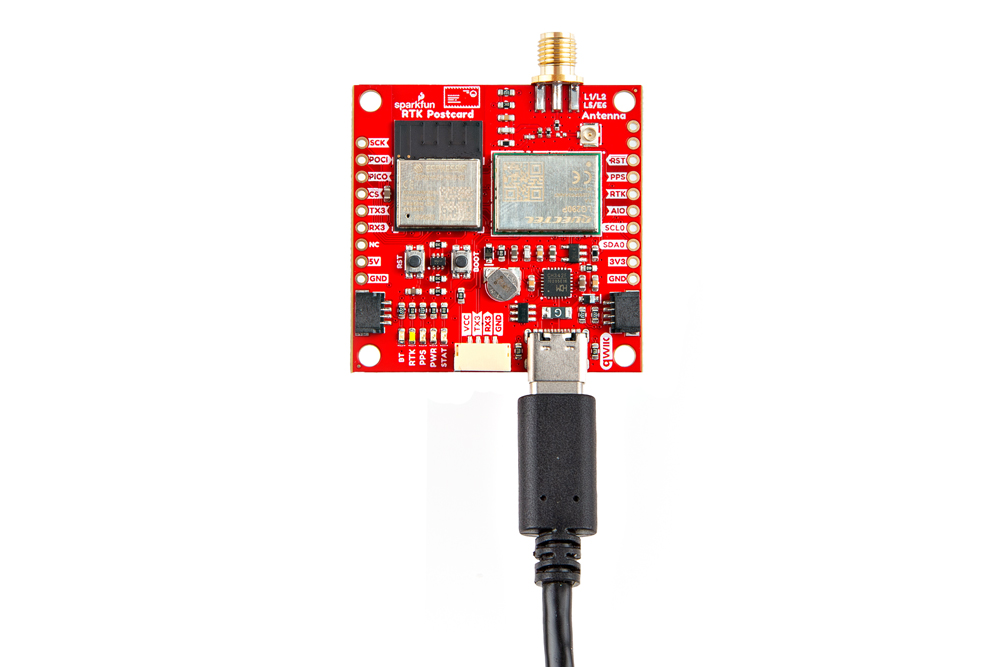
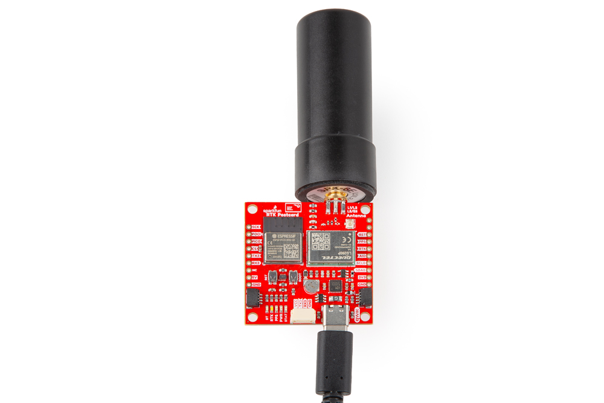
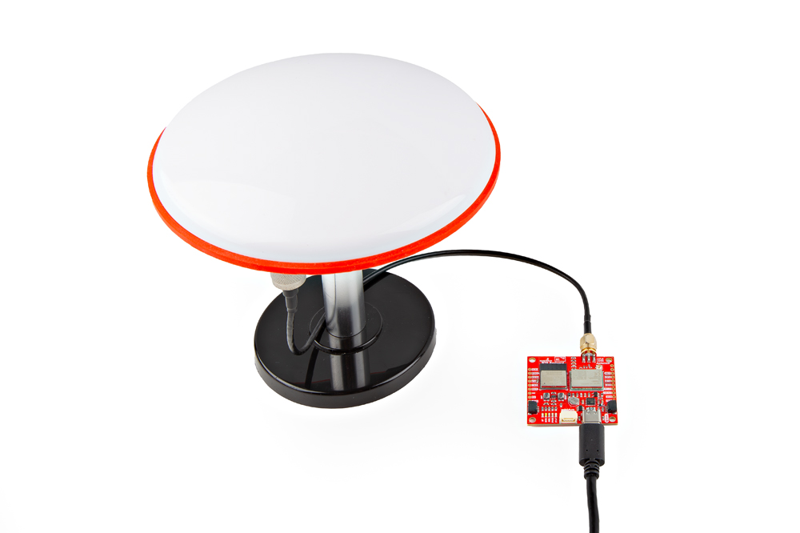
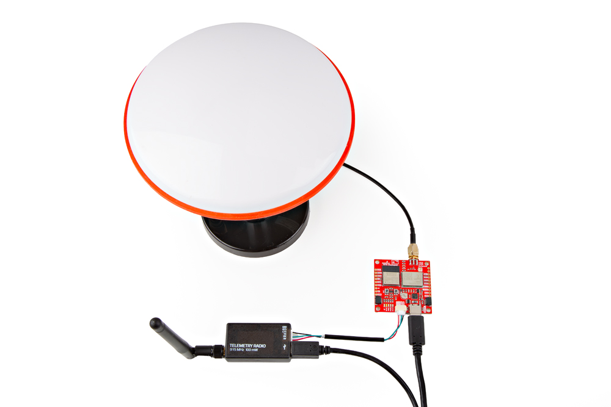
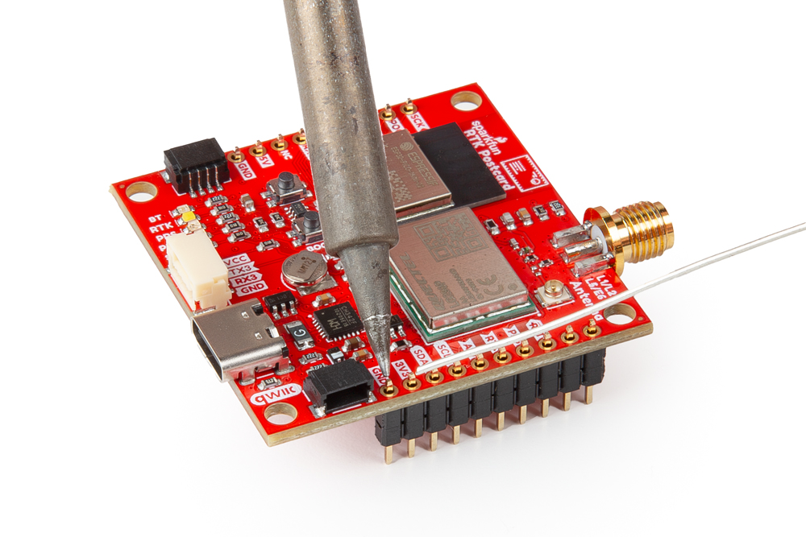
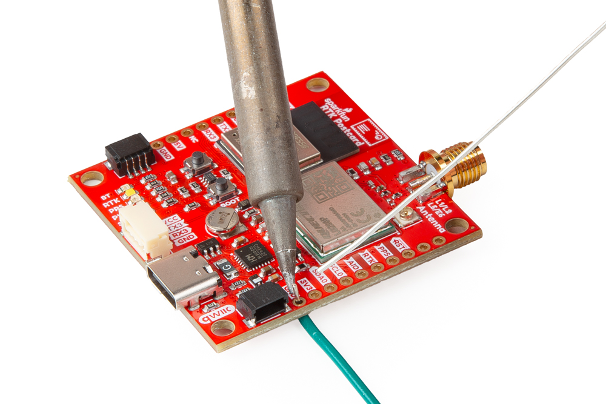

## USB Programming (`UART1`)
The USB connection can be utilized for serial communication and configuring the LG290P GNSS module. Users only need to connect their RTK Postcard to a computer, using a USB-C cable.

<figure markdown>
[{ width="400" }](./assets/img/hookup_guide/assembly-usb.jpg "Click to enlarge")
<figcaption markdown>
The RTK Postcard with USB-C cable being attached.
</figcaption>
</figure>

!!! info "Default Baud Rate"
	The default baud rate of the UART ports on the LG290P is **460800bps**.

## GNSS Antenna
In order to receive [GNSS](https://en.wikipedia.org/wiki/Satellite_navigation "Global Navigation Satellite System") signals, users will need to connect a compatible antenna. For the best performance, we recommend users choose an active, multi-band GNSS antenna and utilize a low-loss cable.

???+ warning "Antenna Specifications"
	- Passive antennas are not recommended for the LG290P GNSS module.
	- To mitigate the impact of out-of-band signals, utilize an active antenna whose SAW filter is placed in front of the LNA in the internal framework.
		- **DO NOT** select and antenna with the LNA placed in the front.
	- There is no need to inject an external DC voltage into the SMA connector for the GNSS antenna. Power is already provided from the LG290P module for the LNA of an active antenna.

<figure markdown>
[{ width="400" }](./assets/img/hookup_guide/assembly-antenna_helical.jpg "Click to enlarge")
<figcaption markdown>
A compact, helical GNSS antenna attached to the SMA connector on the RTK Postcard.
</figcaption>
</figure>

<figure markdown>
[{ width="400" }](./assets/img/hookup_guide/assembly-antenna_ufo.jpg "Click to enlarge")
<figcaption markdown>
A GNSS survey antenna attached to the SMA connector on the RTK Postcard.
</figcaption>
</figure>

## JST Connector (`UART3`)
The JST connector on the Quad-band GNSS RTK board, breaks out the `UART3` port of the LG290P GNSS module. In most circumstances, users will utilize the JST connector to interface with one of our radios to transmit or receive RTK correction data.

<figure markdown>
[{ width="400" }](./assets/img/hookup_guide/assembly-radio_setup.jpg "Click to enlarge")
<figcaption markdown>
The [Telemetry Radio v3](https://www.sparkfun.com/products/19032) connected to the RTK Postcard.
</figcaption>
</figure>

When connecting the RTK Postcard to other products, users should be aware of the pin connections between the devices. The table below, details the pin connections of the locking JST connector on the RTK Postcard.

<article style="text-align: center;" markdown>

<table border="1" markdown>
<tr markdown>
<th style="vertical-align:middle;">Pin Number</th>
<td align="center" markdown>
	**1** 
	*(Left Side)*
</td>
<th align="center">2</td>
<th align="center">3</td>
<th align="center">4</td>
</tr>
<tr>
<th>Label</th>
<td align="center">VCC</td>
<td align="center">TX3</td>
<td align="center">RX3</td>
<td align="center">GND</td>
</tr>
<tr markdown>
<th style="vertical-align:middle;">Function</th>
<td markdown>
	<u>**Voltage Output**</u> 
	- **Default: 3.3V** 
	- 3.3V or 5V
</td>
<td align="center" style="vertical-align:middle;" markdown>`UART3` - Receive</td>
<td align="center" style="vertical-align:middle;" markdown>`UART3` - Transmit</td>
<td align="center" style="vertical-align:middle;">Ground</td>
</tr>
</table>

</article>

!!! info "Default Baud Rate"
	The default baud rate of the UART ports on the LG290P is **460800bps**.

### Radio Transceivers
We have designed the locking JST connector to be plug-n-play with the following devices and cables. However, for the [SiK Telemetry Radio v3](https://www.sparkfun.com/products/19032), users should [modify the `VSEL` jumper](../hardware_overview/#jumpers) (1) on the back of the board to enable a 5V output on the `VCC` pin. Below, is a table summarizing the pin connections of the radios.
{ .annotate }

1. While the [SiK Telemetry Radio v3](https://www.sparkfun.com/products/19032) may function with a **3.3V** input, their specifications stipulate that a **5V** power supply be provided.

<article style="text-align: center;" markdown>

<table border="1" markdown>
<tr markdown>
<th style="vertical-align:middle;">Pin Number</th>
<td align="center" markdown>
	**1** 
	*(Left Side)*
</td>
<td align="center" markdown>**2**</td>
<td align="center" markdown>**3**</td>
<td align="center" markdown>**4**</td>
<td align="center" markdown>**5**</td>
<td align="center" markdown>
	**6** 
	*(Right)*
</td>
</tr>
<tr>
<th style="vertical-align:middle;">Label</th>
<td align="center" style="vertical-align:middle;">5V</td>
<td>
	RX - SiK 
	RXI - LoRaSerial
</td>
<td>
	TX - SiK 
	TXO - LoRaSerial
</td>
<td align="center" style="vertical-align:middle;">CTS</td>
<td align="center" style="vertical-align:middle;">RTS</td>
<td align="center" style="vertical-align:middle;">GND</td>
</tr>
<tr markdown>
<th style="vertical-align:middle;">Function</th>
<td markdown>
	<u>**Voltage Input**</u> 
	- SiK: 5V 
	- LoRaSerial: 3.3 to 5V (1)
</td>
<td align="center" style="vertical-align:middle;">UART - Receive</td>
<td align="center" style="vertical-align:middle;">UART - Transmit</td>
<td align="center" style="vertical-align:middle;" markdown>
	Flow Control 
	*Clear-to-Send*
</td>
<td align="center" style="vertical-align:middle;" markdown>
	Flow Control 
	*Ready-to-Send*
</td>
<td align="center" style="vertical-align:middle;">Ground</td>
</tr>
</table>

</article>

??? tip "Radio Pin Connections"
	

	

	As documented in the [LoRaSerial product manual](https://docs.sparkfun.com/SparkFun_LoRaSerial), the pin connections between a host system *(i.e. RTK Postcard)* and the LoRaSerial radio is outlined in the image below.

	<figure markdown>
	[{ width="400" }](https://docs.sparkfun.com/SparkFun_LoRaSerial/img/SAMD21%20Flow%20control.png "Click to enlarge")
	<figcaption markdown>
	The pin connections between a radio and the RTK Postcard.
	</figcaption>
	</figure>

	

	

	However, the flow control pins *(`CTS` and `RTS`)* are not available on the RTK Postcard. Therefore, when connecting either of the radios, the pin connections should follow the table below:

	<article style="text-align: center;" markdown>

	<table>
	<tr>
	<th>Board</th>
	<td align="center">RX</td>
	<td align="center">TX</td>
	<td align="center">GND</td>
	</tr>
	<tr>
	<th>Radio</th>
	<td align="center">TX</td>
	<td align="center">RX</td>
	<td align="center">GND</td>
	</tr>
	</table>

	</article>

	

	

???+ note "Radio Transceivers and Cables"
	!!! warning "Default Baud Rate"
		The baud rate for these radios are configured by the [`SERIAL_SPEED` parameter](https://docs.sparkfun.com/SparkFun_LoRaSerial/at_commands/#serial-commands). The default configuration is `SERIAL_SPEED`: **57600bps**.

	

	-   <a href="https://www.sparkfun.com/products/19032">
		<figure markdown>
		
		</figure>

		---

		**SiK Telemetry Radio V3 - 915MHz, 100mW** 
		WRL-19032</a>

	-   <a href="https://www.sparkfun.com/products/20029">
		<figure markdown>
		
		</figure>

		---

		**SparkFun LoRaSerial Kit - 915MHz (Enclosed)** 
		WRL-20029</a>

	-   <a href="https://www.sparkfun.com/products/17239">
		<figure markdown>
		
		</figure>

		---

		**JST-GHR-04V to JST-GHR-06V Cable - 1.25mm pitch** 
		CAB-17239</a>

	-   <a href="https://www.sparkfun.com/products/17854">
		<figure markdown>
		
		</figure>

		---

		**GHR-04V-S to GHR-06V-S Cable - 100mm** 
		CAB-17854</a>

	

## Breakout Pins
The [PTH](https://en.wikipedia.org/wiki/Through-hole_technology "Plated Through Holes") pins on the Quad-band GNSS RTK board are broken out into 0.1"-spaced pins on the outer edges of the board.

??? note "New to soldering?"
	If you have never soldered before or need a quick refresher, check out our [How to Solder: Through-Hole Soldering](https://learn.sparkfun.com/tutorials/how-to-solder-through-hole-soldering) guide.

	

	-   <a href="https://learn.sparkfun.com/tutorials/5">
		<figure markdown>
		
		</figure>

		---
	
		**How to Solder: Through-Hole Soldering**</a>

	

-   **Headers**

	---

	When selecting headers, be sure you are aware of the functionality you require.

	<figure markdown>
	[{ width="400" }](./assets/img/hookup_guide/assembly-headers.jpg "Click to enlarge")
	<figcaption markdown>
	Soldering headers to the RTK Postcard.
	</figcaption>
	</figure>

-   **Hookup Wires**

	---

	For a more permanent connection, users can solder wires directly to the board.

	<figure markdown>
	[{ width="400" }](./assets/img/hookup_guide/assembly-hookup_wire.jpg "Click to enlarge")
	<figcaption markdown>
	Soldering wires to the RTK Postcard.
	</figcaption>
	</figure>

