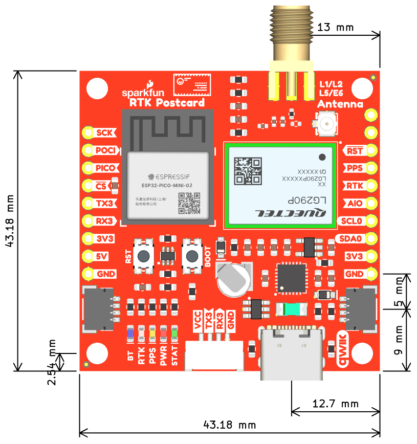
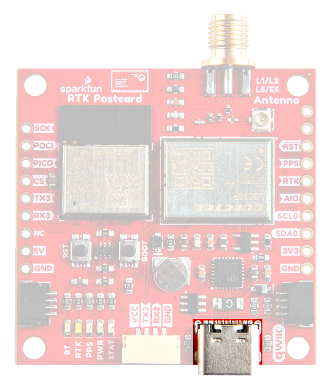
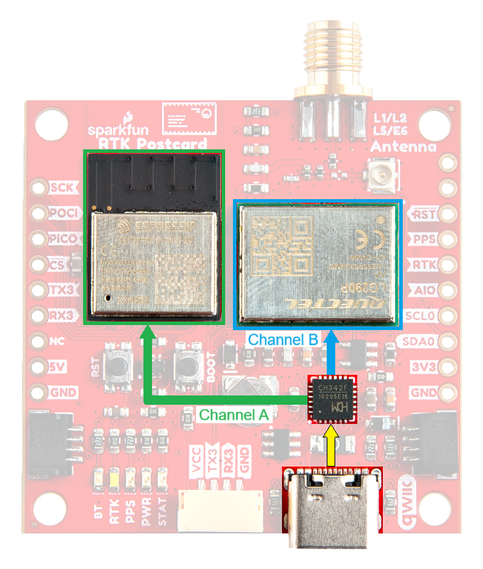
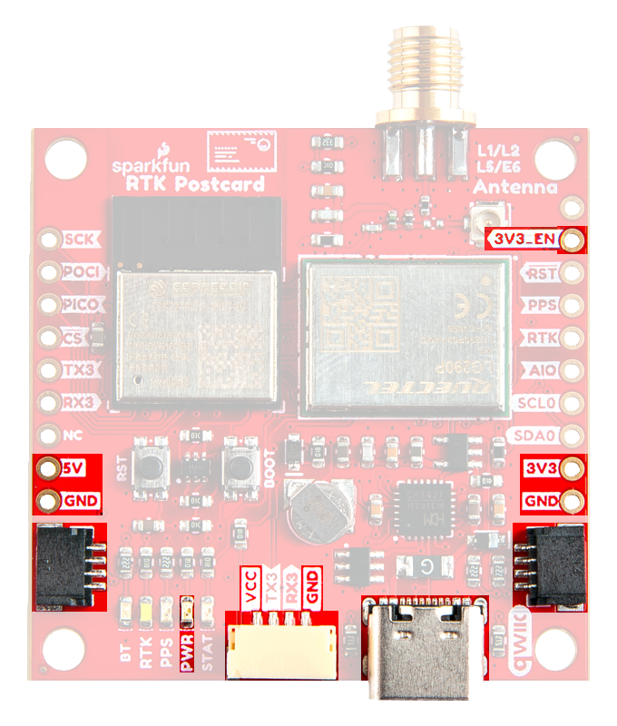
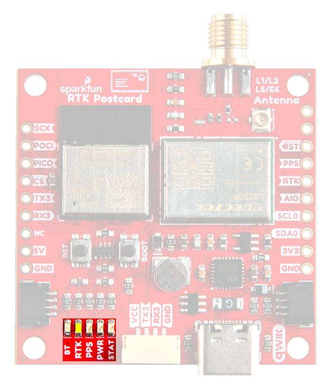
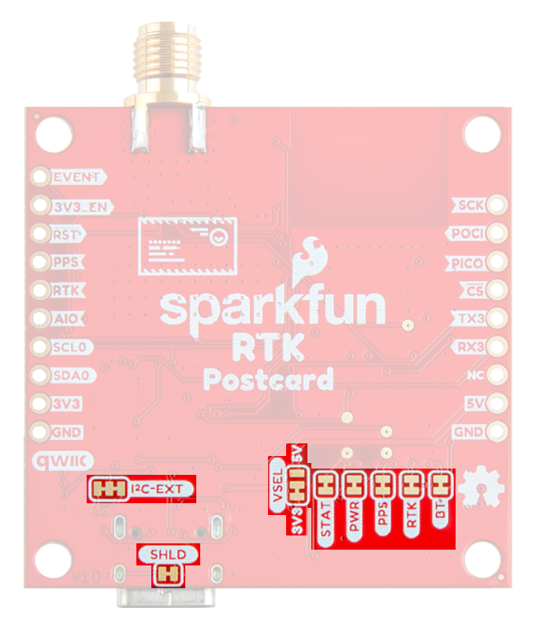

## :material-folder-cog: Design Files
The SparkFun RTK Postcard board's dimensions, pin layout, and connectors are similar to our very popular [SparkFun GPS-RTK-SMA Breakout - ZED-F9P (Qwiic)](https://www.sparkfun.com/products/16481) and [SparkFun Quadband GNSS RTK Breakout - LG290P (Qwiic)](https://www.sparkfun.com/products/26620). The board features multiple UART ports, which are accessible through the USB-C connector, PTH pins, and 4-pin locking JST connector. Users can also interface with the board through the 19 PTH pins that are broken out around the edge of the board. For the GNSS antenna, an SMA antenna connector is provided on the edge of the board; additionally, users can rework the board to utilize the u.fl connector instead. We also provide two 4-pin JST Qwiic connectors for future use, to operate the board as a peripheral device.

<!-- Import the component -->

-   :kicad-primary:{ .enlarge-logo } Design Files

	---

	- :fontawesome-solid-file-pdf: [Schematic](./assets/board_files/schematic.pdf)
	- :material-folder-zip: [KiCad Files](./assets/board_files/kicad_files.zip)
	- :material-cube-outline: [STEP File](./assets/3d_model/cad_model.step)
	<!-- - :material-rotate-3d: [STEP File](./assets/3d_model/cad_model.step) -->
	- :fontawesome-solid-file-pdf: [Board Dimensions](./assets/board_files/dimensions.pdf):
		- 1.70" x 1.70" (43.2mm x 43.2mm)
		- Four mounting holes:
			- 4-40 screw compatible

-   <!-- Boxes in tabs -->

	=== "3D Model"
		???+ example "RTK Postcard"
			

			<model-viewer src="../assets/3d_model/web_model.glb" camera-controls poster="../assets/3d_model/poster.png" tone-mapping="neutral" shadow-intensity="1.3" exposure="0.85" shadow-softness="0.45" environment-image="legacy" camera-orbit="39.22deg 54.28deg 0.1361m" field-of-view="29deg" style="width: 100%; height: 450px;">
			</model-viewer>

			[Download the `*.step` File](./assets/3d_model/cad_model.step "Click download"){ .md-button .md-button--primary width="250px" }

			

		??? example "Enclosure"
			

			<model-viewer src="../assets/3d_model/enclosure/web_model.glb" camera-controls poster="../assets/3d_model/enclosure/poster.png" tone-mapping="neutral" shadow-intensity="0.9" environment-image="legacy" exposure="0.6" shadow-softness="0.7" camera-orbit="-756.1deg 62.5deg 140.1m" field-of-view="30deg" style="width: 100%; height: 450px;">
			</model-viewer>

			[Download the `*.step` File](./assets/3d_model/enclosure/enclosure.step "Click download"){ .md-button .md-button--primary width="250px" }

			

		??? tip "Manipulate 3D Model"
			

			| Controls       | Mouse                    | Touchscreen    |
			| :------------- | :----------------------: | :------------: |
			| Zoom           | Scroll Wheel             | 2-Finger Pinch |
			| Rotate         | ++"Left-Click"++ & Drag  | 1-Finger Drag  |
			| Move/Translate | ++"Right-Click"++ & Drag | 2-Finger Drag  |

			

	=== "Dimensions"
		

		[{ width="450" }](./assets/board_files/dimensions.png "Click to enlarge")
		<figcaption markdown>
		Dimensions of the RTK Postcard.
		</figcaption>
		

		??? tip "Need more measurements?"
			For more information about the board's dimensions, users can download the [KiCad files](./assets/board_files/kicad_files.zip) for this board. These files can be opened in KiCad and additional measurements can be made with the measuring tool.

			!!! info ":octicons-download-16:{ .heart } KiCad - Free Download!"
				KiCad is free, open-source [CAD]("computer-aided design") program for electronics. Click on the button below to download their software. *(\*Users can find out more information about KiCad from their [website](https://www.kicad.org/).)*

				

				[Download :kicad-primary:{ .enlarge-logo }](https://www.kicad.org/download/ "Go to downloads page"){ .md-button .md-button--primary width="250px" }
				

	
			??? info ":straight_ruler: Measuring Tool"
				This video demonstrates how to utilize the dimensions tool in KiCad, to include additional measurements:

				

				<article class="video-500px">
				<iframe src="https://www.youtube.com/embed/-eXuD8pkCYw" title="KiCad Dimension Tool" frameborder="0" allow="accelerometer; autoplay; clipboard-write; encrypted-media; gyroscope; picture-in-picture" allowfullscreen></iframe>
				</article>
				{ .qr }
				

## USB-C Connector
The USB connector is provided to power the board and communicate with either the LG290P GNSS receiver or ESP32 microcontroller. For most users, it will be the primary method for interfacing with the RL Postcard.

<figure markdown>
[{ width="400" }](./assets/img/hookup_guide/usb_connector.png "Click to enlarge")
<figcaption markdown>
USB-C connector on the RTK Postcard.
</figcaption>
</figure>

### CH342 Dual UART Converter
The CH342 serial-to-USB converter allows users to interface with the `UART1` port of the LG290P GNSS module and `UART0` port of the ESP32-Pico module through the USB-C connector. To utilize the CH342, users may need to install a USB driver, which can be downloaded from the [manufacturer website](https://www.wch-ic.com/search?q=CH342&t=downloads).

??? tip "Tip - USB Drivers"
	

	-   :material-microsoft-windows: **Windows**

		---

		[:octicons-download-16:{ .heart } Download Page for <code>CH343SER.EXE</code>](https://www.wch-ic.com/downloads/CH343SER_EXE.html){ .md-button .md-button--primary target="blank" }

	-   :material-apple: **MacOS**

		---

		[:octicons-download-16:{ .heart } Download Page for `CH341SER_MAC.ZIP`](https://www.wch-ic.com/downloads/CH34XSER_MAC_ZIP.html){ .md-button .md-button--primary target="blank" }

	

	!!! info "Linux"
		A USB driver is not required for Linux based operating systems.

Once the USB driver is installed, two virtual `COM` ports will be emulated and can be utilized as standard `COM` ports to access the modules:

- **ESP32** - Users should select `COM` port with the lower enumeration or the one labeled as `Channel A`.
- **LG290P** - Users should select `COM` port with the higher enumeration or the one labeled as `Channel B`.

<figure markdown>
[{ width="400" }](./assets/img/hookup_guide/ch342-uarts.png "Click to enlarge")
<figcaption markdown>
The `UART` channels of the CH342 serial-to-USB converter on the RTK Postcard.
</figcaption>
</figure>

## Power
The RTK Postcard only requires **3.3V** to power the board's primary components. The simplest method to power the board is through the USB-C connector. Alternatively, the board can also be powered through the other connectors and [PTH](https://en.wikipedia.org/wiki/Through-hole_technology "Plated Through Holes") pins.

<figure markdown>
[{ width="400" }](./assets/img/hookup_guide/power_connections.png "Click to enlarge")
<figcaption markdown>
RTK Postcard's power connections.
</figcaption>
</figure>

Below, is a general summary of the power circuitry for the board:

- **`5V`** - The voltage from the USB-C connector, usually **5V**.
	- Can be utilized as the primary power source for the entire board.
	- When connected to the [Portability Shield](https://www.sparkfun.com/products/27510), this pin used to provide power between the boards. (1)
- **`3V3`** - 3.3V power rail, which powers the ESP32 Pico-Mini module, LG290P GNSS module, backup battery, and LEDs.
	- Power can also be distributed to/from any of the JST connectors *(Qwiic or `UART3`)* or the `3V3` PTH pin.
		- For power that is supplied through these connections, the LG290P has the tighter supply voltage requirement of **3.15–3.45V**.
	- A regulated **3.3V** is supplied by the [RT9080](./assets/component_documentation/DS9080.pdf), when powered from the `5V` PTH pin or USB connector
		- Input Voltage Range: **3.0 to 5.5V** (2)
		- The RT9080 LDO regulator can source up to 600mA.
- **`3V3_EN`** - Controls the power output form the RT9080 voltage regulator.
	- By default, the pin is pulled-up to 5V and to enable the RT9080 output voltage.
- **`GND`** - The common ground or the 0V reference for the voltage supplies.

1. !!! abstract "Details"
	When **5V** is provided to the RTK Postcard, it will supply power to the Portability Shield and charge the LiPo battery *(if connected)*. In order for the fuel gauge to operate properly when charging the battery, the power switch behind the OLED display of the Portability Shield should be in the `OFF` position.

	When powered by a LiPo battery, users must toggle the power switch behind the OLED display of the Portability Shield. This will provide power to the RTK Postcard through the **`5V`** pin, to the [RT9080 LDO](./assets/component_documentation/DS9080.pdf).

	Diodes are utilized on the boards to independently prevent current feedback and protect the power sources from each other.

1. !!! warning "Brown Out Voltage"
	The supply voltage of a LiPo battery will decrease as it is drained. However, before the battery can reach its critical UVLO threashold, the LG290 GNSS module with begin to brown out from an in-use supply voltage of **3.05-3.10V**.

!!! info
	For more details, users can reference the [schematic](./assets/board_files/schematic.pdf) and the datasheets of the individual components on the board.
## Status LEDs
There are five status LEDs on the RTK Postcard:

<figure markdown>
[{ width="400" }](./assets/img/hookup_guide/LEDs.png "Click to enlarge")
<figcaption markdown>
The status LED indicators on the RTK Postcard.
</figcaption>
</figure>

- `BT` - Bluetooth *(Blue)*
	- With the [RTK Everywhere firmware](https://github.com/sparkfun/SparkFun_RTK_Everywhere_Firmware), this LED indicates when the ESP32 Pico-Mini module is paired with a Bluetooth device
- `RTK` - [RTK](https://en.wikipedia.org/wiki/Real-time_kinematic_positioning "Real-Time Kinematic") Mode *(White)*
	- Indicates when an RTK fix has been established or when the correct RTCM data is being received *(see the **[RTK](#rtk)** section)*
- `PPS` - Pulse-Per-Second *(Yellow)*
	- Indicates when there is a pulse-per-second signal *(see the **[PPS Output](#pps-output)** section)*
- `PWR` - Power *(Red)*
	- Turns on once 3.3V power is supplied to the board
- `STAT` - Status *(Green)*
	- With the [RTK Everywhere firmware](https://github.com/sparkfun/SparkFun_RTK_Everywhere_Firmware), this LED indicates the operation mode

## Jumpers

??? note "Never modified a jumper before?"
	Check out our <a href="https://learn.sparkfun.com/tutorials/664">Jumper Pads and PCB Traces tutorial</a> for a quick introduction!

	

	-   <a href="https://learn.sparkfun.com/tutorials/664">
		<figure markdown>
		
		</figure>

		---

		**How to Work with Jumper Pads and PCB Traces**</a>

	

There are eight jumpers on the back of the board that can be used to easily modify the hardware connections on the board. From which, there are five jumpers that control power to the status LEDs on the board. By default, all the jumpers are connected to power the status LEDs. For low power applications, users can cut the jumpers to disconnect power from each of the LEDs.

<figure markdown>
[{ width="400" }](./assets/img/hookup_guide/jumpers.png "Click to enlarge")
<figcaption markdown>
The jumpers on the back of the RTK Postcard.
</figcaption>
</figure>

- **`VSEL`** - This jumper can be modified to configure/disconnect the `VCC` pin of the 4-pin locking JST connector to/from `3V3` or `5V` power.
- **`BT`** - This jumper can be cut to disconnect the `3V3` BlueSMiRF header pin from the 3.3V output of the RT9080 LDO regulator.
- **`PWR`** - This jumper can be cut to remove power from the red, power LED.
- **`PPS`** - This jumper can be cut to remove power from the yellow LED, which is connected to the [PPS](https://en.wikipedia.org/wiki/Pulse-per-second_signal "Pulse Per Second") signal.
- **`RTK`** - This jumper can be cut to remove power from the white LED, indicating RTK fix or operation in RTK mode.
- **`STAT`** - This jumper can be cut to disconnect the [pulse per second](https://en.wikipedia.org/wiki/Pulse-per-second_signal "Pulse Per Second") signal from the [PTH](https://en.wikipedia.org/wiki/Through-hole_technology "Plated Through Holes") pin.
- **`SHLD`** - This jumper can be cut to disconnect the shielding of the USB-C connector from the `GND` plane of the board
- **`I2C-EXT`**

!!! info
	- By default, [PPS](https://en.wikipedia.org/wiki/Pulse-per-second_signal "Pulse Per Second") signal is connected to the `PPS` pin.
	- By default, the `VSEL` jumper is connected to `3V3` pad for a regulated 3.3V output on the 4-pin JST-GH connector.
	- By default, the `BT_VCC` jumper provides a regulated 3.3V output to the BlueSMiRF header.

