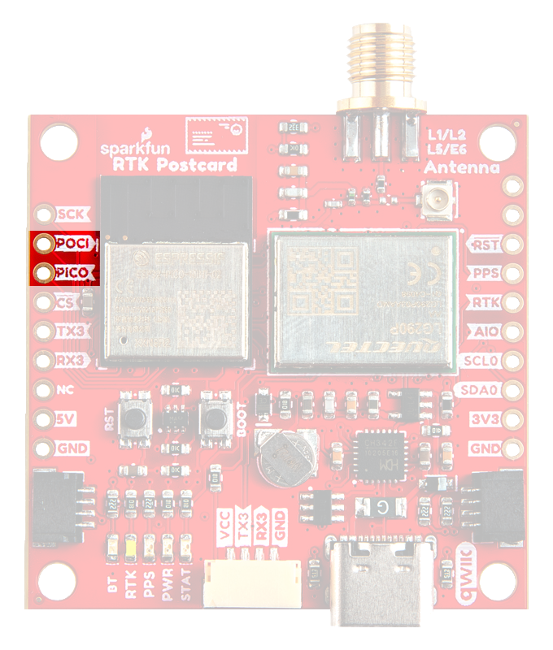
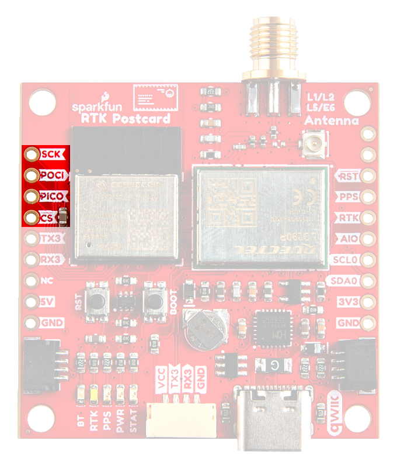
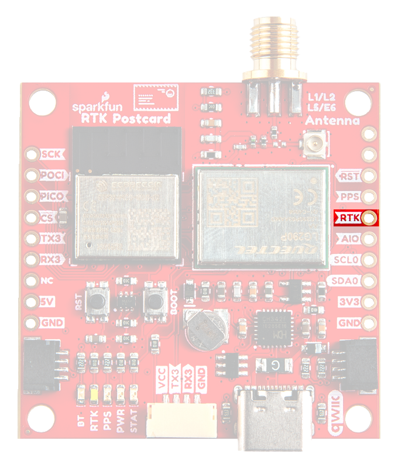

## :material-folder-cog: Design Files
The SparkFun RTK Postcard board's dimensions, pin layout, and connectors are similar to our very popular [SparkFun GPS-RTK-SMA Breakout - ZED-F9P (Qwiic)](https://www.sparkfun.com/products/16481) and [SparkFun Quadband GNSS RTK Breakout - LG290P (Qwiic)](https://www.sparkfun.com/products/26620). The board features multiple UART ports, which are accessible through the USB-C connector, [PTH](https://en.wikipedia.org/wiki/Through-hole_technology "Plated Through Holes") pins, and 4-pin locking JST connector. Users can also interface with the board through the 19 [PTH](https://en.wikipedia.org/wiki/Through-hole_technology "Plated Through Holes") pins that are broken out around the edge of the board. For the GNSS antenna, an SMA antenna connector is provided on the edge of the board; additionally, users can rework the board to utilize the u.fl connector instead. We also provide two 4-pin JST Qwiic connectors for future use, to operate the board as a peripheral device.

<!-- Import the component -->

-   :kicad-primary:{ .enlarge-logo } Design Files

	---

	- :fontawesome-solid-file-pdf: [Schematic](./assets/board_files/schematic.pdf)
	- :material-folder-zip: [KiCad Files](./assets/board_files/kicad_files.zip)
	- :material-rotate-3d: STEP Files
		- :material-developer-board: [RTK Postcard](./assets/3d_model/cad_model.step)
		- :material-cube-outline: [Enclosure](./assets/3d_model/enclosure/enclosure.step)
	<!-- - :material-rotate-3d: [STEP File](./assets/3d_model/cad_model.step) -->
	- :fontawesome-solid-file-pdf: [Board Dimensions](./assets/board_files/dimensions.pdf):
		- 1.70" x 1.70" (43.2mm x 43.2mm)
		- Four mounting holes:
			- 4-40 screw compatible

-   <!-- Boxes in tabs -->

	=== "3D Model"
		???+ example "RTK Postcard"
			

			<model-viewer src="../assets/3d_model/web_model.glb" camera-controls poster="../assets/3d_model/poster.png" tone-mapping="neutral" shadow-intensity="1.3" exposure="0.85" shadow-softness="0.45" environment-image="legacy" camera-orbit="39.22deg 54.28deg 0.1361m" field-of-view="29deg" style="width: 100%; height: 450px;">
			</model-viewer>

			[Download the `*.step` File](./assets/3d_model/cad_model.step "Click download"){ .md-button .md-button--primary width="250px" }

			

		??? example "Enclosure"
			

			<model-viewer src="../assets/3d_model/enclosure/web_model.glb" camera-controls poster="../assets/3d_model/enclosure/poster.png" tone-mapping="neutral" shadow-intensity="0.9" environment-image="legacy" exposure="0.6" shadow-softness="0.7" camera-orbit="-756.1deg 62.5deg 140.1m" field-of-view="30deg" style="width: 100%; height: 450px;">
			</model-viewer>

			[Download the `*.step` File](./assets/3d_model/enclosure/enclosure.step "Click download"){ .md-button .md-button--primary width="250px" }

			

		??? tip "Manipulate 3D Model"
			

			| Controls       | Mouse                    | Touchscreen    |
			| :------------- | :----------------------: | :------------: |
			| Zoom           | Scroll Wheel             | 2-Finger Pinch |
			| Rotate         | ++"Left-Click"++ & Drag  | 1-Finger Drag  |
			| Move/Translate | ++"Right-Click"++ & Drag | 2-Finger Drag  |

			

	=== "Dimensions"
		

		[{ width="450" }](./assets/board_files/dimensions.png "Click to enlarge")
		<figcaption markdown>
		Dimensions of the RTK Postcard.
		</figcaption>
		

		??? tip "Need more measurements?"
			For more information about the board's dimensions, users can download the [KiCad files](./assets/board_files/kicad_files.zip) for this board. These files can be opened in KiCad and additional measurements can be made with the measuring tool.

			!!! info ":octicons-download-16:{ .heart } KiCad - Free Download!"
				KiCad is free, open-source [CAD]("computer-aided design") program for electronics. Click on the button below to download their software. *(\*Users can find out more information about KiCad from their [website](https://www.kicad.org/).)*

				

				[Download :kicad-primary:{ .enlarge-logo }](https://www.kicad.org/download/ "Go to downloads page"){ .md-button .md-button--primary width="250px" }
				

	
			??? info ":straight_ruler: Measuring Tool"
				This video demonstrates how to utilize the dimensions tool in KiCad, to include additional measurements:

				

				<article class="video-500px">
				<iframe src="https://www.youtube.com/embed/-eXuD8pkCYw" title="KiCad Dimension Tool" frameborder="0" allow="accelerometer; autoplay; clipboard-write; encrypted-media; gyroscope; picture-in-picture" allowfullscreen></iframe>
				</article>
				{ .qr }
				

## USB-C Connector
The USB connector is provided to power the board and communicate with either the LG290P GNSS receiver or ESP32 microcontroller. For most users, it will be the primary method for interfacing with the RL Postcard.

<figure markdown>
[{ width="400" }](./assets/img/hookup_guide/usb_connector.png "Click to enlarge")
<figcaption markdown>
USB-C connector on the RTK Postcard.
</figcaption>
</figure>

### CH342 Dual UART Converter
The CH342 serial-to-USB converter allows users to interface with the `UART1` port of the LG290P GNSS module and `UART0` port of the ESP32-Pico module through the USB-C connector. To utilize the CH342, users may need to install a USB driver, which can be downloaded from the [manufacturer website](https://www.wch-ic.com/search?q=CH342&t=downloads).

??? tip "Tip - USB Drivers"
	

	-   :material-microsoft-windows: **Windows**

		---

		[:octicons-download-16:{ .heart } Download Page for <code>CH343SER.EXE</code>](https://www.wch-ic.com/downloads/CH343SER_EXE.html){ .md-button .md-button--primary target="blank" }

	-   :material-apple: **MacOS**

		---

		[:octicons-download-16:{ .heart } Download Page for `CH341SER_MAC.ZIP`](https://www.wch-ic.com/downloads/CH34XSER_MAC_ZIP.html){ .md-button .md-button--primary target="blank" }

	

	!!! info "Linux"
		A USB driver is not required for Linux based operating systems.

<figure markdown>
[{ width="400" }](./assets/img/hookup_guide/ch342-uarts.png "Click to enlarge")
<figcaption markdown>
The `UART` channels of the CH342 serial-to-USB converter.
</figcaption>
</figure>

Once the USB driver is installed, two virtual `COM` ports will be emulated and can be utilized as standard `COM` ports to access the modules:

- **ESP32** - Users should select `COM` port labeled with `Channel A` *(often the lower enumeration)*.
- **LG290P** - Users should select `COM` port labeled with `Channel B` *(often the higher enumeration)*.

	???+ info "UART Settings"
		

		- **ESP32**

			---

			With the [RTK Everywhere firmware](https://github.com/sparkfun/SparkFun_RTK_Everywhere_Firmware), the `UART0` port of the ESP32 is configured with the following settings:

			- Baudrate: **115200bps**
			- Data Bits: 8
			- Parity: No
			- Stop Bits: 1

		- **LG290P**

			---

			With the [RTK Everywhere firmware](https://github.com/sparkfun/SparkFun_RTK_Everywhere_Firmware), the `UART2` port of the LG290P is configured with the following settings:

			- Baudrate: **460800bps**
			- Data Bits: 8
			- Parity: No
			- Stop Bits: 1

			??? info "Default Configuration"
				The UART ports of the LG290P are configured with the following default settings:

				- Baudrate: **460800bps**
				- Data Bits: 8
				- Parity: No
				- Stop Bits: 1
				- Flow Control: None
				- Protocols:
					- `NMEA 0183`
					- `RTCM 3.x`

		

## Power
The RTK Postcard only requires **3.3V** to power the board's primary components. The simplest method to power the board is through the USB-C connector. Alternatively, the board can also be powered through the other connectors and [PTH](https://en.wikipedia.org/wiki/Through-hole_technology "Plated Through Holes") pins.

<figure markdown>
[{ width="400" }](./assets/img/hookup_guide/power_connections.png "Click to enlarge")
<figcaption markdown>
RTK Postcard's power connections.
</figcaption>
</figure>

Below, is a general summary of the power circuitry for the board:

- **`5V`** - The voltage from the USB-C connector, usually **5V**.
	- Can be utilized as the primary power source for the entire board.
	- When connected to the [Portability Shield](https://www.sparkfun.com/products/27510), this pin used to provide power between the boards. (1)
- **`3V3`** - 3.3V power rail, which powers the ESP32 Pico-Mini module, LG290P GNSS module, backup battery, and LEDs.
	- Power can also be distributed to/from any of the JST connectors *(Qwiic or `UART3`)* or the `3V3` PTH pin.
		- For power that is supplied through these connections, the LG290P has the tightest voltage supply requirement of **3.15–3.45V**.
	- A regulated **3.3V** is supplied by the [RT9080](./assets/component_documentation/DS9080.pdf), when powered from the `5V` PTH pin or USB connector
		- Input Voltage Range: **3.0 to 5.5V** (2)
		- The RT9080 LDO regulator can source up to 600mA.
- **`3V3_EN`** - Controls the power output form the RT9080 voltage regulator.
	- By default, the pin is pulled-up to 5V and to enable the RT9080 output voltage.
- **`VCC`** - The voltage from the locking JST-GH connector, which is controlled by the `VSEL` jumper (3).
	- Used to power an external radio to send or receive RTK corrections.
- **`GND`** - The common ground or the 0V reference for the voltage supplies.

1. !!! abstract "Details"

		When **5V** is provided to the RTK Postcard, it will supply power to the Portability Shield and charge the LiPo battery *(if connected)*. To operate properly when charging the battery, the power switch behind the OLED display of the Portability Shield should be in the `Off` position.

		When powered by a LiPo battery, users must toggle the power switch behind the OLED display of the Portability Shield to the `On` position. This will allow the battery power to be provided to the RTK Postcard through the **`5V`** pin; and then to its [RT9080 LDO](./assets/component_documentation/DS9080.pdf).

		Protection diodes are utilized on the boards to independently prevent current feedback and protect the power sources from each other.

1. !!! warning "Brown Out Voltage"

		The supply voltage of a LiPo battery will decrease as it is drained. However, before the battery can reach its critical UVLO threshold *(~2.8V)*, the LG290 GNSS module with begin to brown out from an in-use supply voltage of **3.05-3.10V** from a battery.

	!!! warning "Battery Capacity"

		When selecting a LiPo battery for any combination of the RTK Postcard, Portability Shield, and/or connected radio, users should be aware of the peak current draw of their setup. In theory, most standard LiPo batteries have a maximum discharge rate of 1C *(based on the battery capacity)*.

		$$
		1C = \frac{(1 * Capacity)}{hour}
		$$

		However, as a battery ages, users may find the effective capacity and discharge rate to degrade to 80% of its original specifications.

		!!! example

			For example, a LiPo battery with a **400mAh capacity** will have a maximum **discharge rate of 400mA**. However, over time, users may notice its effective use diminish to 320mAh and 320mA respectively.

1. By default, the `VSEL` jumper is configured to utilize the **3.3V** power rail; however, it can be connected to the 5V power rail instead.

	!!! warning "Portability Shield"

		When utilizing the 5V power rail of the RTK Postcard, power may be supplied from the LiPo battery from the Portability Shield. This should be taken into consideration when connecting an external radio for RTK corrections.

!!! info
	For more details, users can reference the [schematic](./assets/board_files/schematic.pdf) and the datasheets of the individual components on the board.

!!! tip "Portability Shield"
	When used in conjunction with the [Portability Shield](https://www.sparkfun.com/products/27510), users should be aware of the following:

	- To charge the battery, users must provide adequate power through the `5V` pin. This is most easily done by powering the boards from the USB-C connector.
	- When operating the boards with the battery power, users must ensure that the switch behind the OLED display is in the `On` position. This will allow the battery power to feedback to the RTK Postcard through the `5V` pin; and over to the RT9080 LDO to provide a regulated 3.3V to its primary components.

### Backup Battery
While charged, the backup battery allows the GNSS module to hot/warm start with valid ephemeris data (time and GNSS orbital trajectories) that was stored.

**Time to First Fix:**

- Cold Start: 28s
- Warm Start: 28s
- Hot Start: 1.7s

## :espressif-logo:&nbsp; ESP32 Pico-Mini
The brains of the RTK Postcard is an [ESP32 Pico-Mini module](https://espressif.com/sites/default/files/documentation/esp32-pico-mini-02_datasheet_en.pdf). The Espressif series of ESP32 modules are a versatile, compact MCU modules with WiFi, BT, and BLE capabilities that target a wide variety of applications. At the core of the ESP32 Pico-Mini module is the ESP32-PICO-V3-02, a System-in-Package device, along with an integrated 8 MB SPI flash, 2 MB SPI PSRAM, and 40 MHz oscillator.

<figure markdown>
[{ width="300" }](./assets/img/hookup_guide/esp32.png "Click to enlarge")
<figcaption markdown>
The ESP32 Pico-Mini module on the RTK Postcard.
</figcaption>
</figure>

??? info "General Features"
	

	

	- Electrical Characteristics:
		- Operating Voltage: **3.0 - 3.6V**
		- Current Consumption:
			- RF Operation: 368mA *(peak)*
			- Normal Operation: 20-31mA
			- Light-Sleep: 0.8mA
			- Deep-Sleep: 5µA
	- Xtensa® Dual-Core 32-bit LX6 Microprocessor *(up to 240MHz)*
		- 448KB of ROM and 520KB SRAM
		- 8MB SPI Flash
		- 2MB PSRAM
		- 16KB SRAM in RTC
	- Operating Temperature: -40 to 85&deg;C

	

	

	- PCB antenna
	- Wi­F 802.11b/g/n
		- Bit Rate: up to 150Mbps *(802.11n)*
		- Frequency Range: 2412 - 2484MHz
	- Bluetooth
		- Bluetooth v4.2 Specification:
			- BR/EDR
			- Bluetooth LE
		- Transmitter Class: 1, 2, and 3
	- 27 GPIO *(including strapping pins)*
		-
	- Supported Peripherals:
		- SD card, UART, SPI, SDIO, I2C, LED PWM, Motor PWM, I2S, IR, pulse counter, GPIO, capacitive touch sensor, ADC, DAC, TWAI® (compatible with ISO 11898-1, i.e. CAN Specification 2.0), Ethernet MAC

	

	

???+ warning
	Users should be aware of the following nuances and details of this microcontroller

	- The ESP32 Pico-Mini is only compatible with **2.4GHz WiFi** networks; it will not work on the 5GHz bands.
	- For details on the boot mode configuration, please refer to [section **3.3 Strapping Pins**](./assets/component_documentation/esp32_datasheet_en.pdf#8) of the ESP32 SoC datasheet.

???+ info "RTK Everywhere Firmware"
	The RTK Postcard comes pre-programmed with latest version of our [RTK Everywhere firmware](https://github.com/sparkfun/SparkFun_RTK_Everywhere_Firmware). However, users are free to reprogram the board as they see fit. For more details about the RTK Everywhere firmware, users can refer to the [user manual](http://docs.sparkfun.com/SparkFun_RTK_Everywhere_Firmware/).

???+ tip "Firmware Download Mode"
	Users can manually force the board into the <a href="https://docs.espressif.com/projects/esptool/en/latest/esp32/advanced-topics/boot-mode-selection.html#select-bootloader-mode">serial bootloader</a> with the ++"BOOT"++ button. Please, refer to the [**Boot Button** section](#boot-button) below for more information.

??? info "Power Modes"
	The ESP32 Pico-Mini module has various power modes:

	- **Active** -  The chip radio is powered on. The chip can receive, transmit, or listen.
	- **Modem Sleep** - The CPU is operational and the clock is configurable. The Wi-Fi/Bluetooth	baseband and radio are disabled.
	- **Light Sleep** - The CPU is paused. The RTC memory and RTC peripherals, as well as the ULP	coprocessor are running.
	- **Deep Sleep** - Only the RTC memory and RTC peripherals are powered on. The ULP coprocessor is functional.
	- **Hibernation** - Only one RTC timer on the slow clock and certain RTC GPIO	active.
	- **Off** - Chip is powered off.

	*For more information on the power management of the ESP32 Pico-Mini module, pleaser refer to **Section 4.4** and **Tables: 8 and 9** of the [ESP32 Pico-Mini module datasheet](./assets/component_documentation/esp32-pico-mini-02_datasheet_en.pdf).*

### Peripherals and I/O Pins
The ESP32 Pico-Mini module features *27 multifunctional GPIO* pins, of which, **11 I/O pins** broken out into [PTH](https://en.wikipedia.org/wiki/Through-hole_technology "Plated Through Holes") pins on the RTK Postcard. Meanwhile, others are utilized to interface with the LG290P GNSS receiver or other components on the board *(i.e. USB connector, Qwiic connector, etc.)*. All of the RTK Postcard [PTH](https://en.wikipedia.org/wiki/Through-hole_technology "Plated Through Holes") pins have a .1" pitch spacing for standard headers and their pin layout is compatible with our [Portability Shield](https://www.sparkfun.com/products/27510).

<figure markdown>
[{ width="400" }](./assets/img/hookup_guide/esp32-peripherals3.png "Click to enlarge")
<figcaption markdown>
The peripheral interfaces and I/O pins on the RTK Postcard.
</figcaption>
</figure>

**Interfaces:**

- UART (x2)
- SPI
- I^2^C (x2)
- ~~Event Trigger[^4]~~
- RTK Signal
- Interrupt
- PPS Timing Signal
- LG290P Module Reset

| ESP32 GPIO  | PTH Pin | LG290P IO  | Other       |
| :---------: | :-----: | :--------: | :---------: |
| `GPIO 7`    | `SDA0`  | `I2C_SDA`  |             |
| `GPIO 20`   | `SCL0`  | `I2C_SCL`  |             |
| `GPIO 13`   |         |            | Qwiic `SDA` |
| `GPIO 19`   |         |            | Qwiic `SCL` |
| `GPIO 21`   |         | `TXD2`     |             |
| `GPIO 22`   |         | `RXD2`     |             |
| `GPIO 33`   | `RST`   | `RESET_N`  |             |
| `GPIO 34`   | `RTK`   | `RTK_STAT` | LED `RTK`   |
| `GPIO 36`   | `PPS`   | `1PPS`     | LED `PPS`   |
| `GPIO 8`    | `EVENT` | `EVENT`    |             |
| `GPIO 32`   | `SCK`   |            |             |
| `GPIO 25`   | `POCI`  |            |             |
| `GPIO 26`   | `PICO`  |            |             |
| `GPIO 27`   | `CS`    |            |             |
| `GPIO 14`   | `AOI`   |            |             |
| `GPIO 4`    |         |            | LED `BT`    |
| `GPIO 0`    |         |            | LED `STAT`  |

??? info "General Capabilities"
	With the [pin multiplexing](https://docs.espressif.com/projects/arduino-esp32/en/latest/tutorials/io_mux.html?#id1) capabilities of the ESP32 SoC, various pins can have several functionalities. For more technical specifications on the **I/O** pins, please refer to the [ESP32 SoC datasheet](./assets/component_documentation/esp32_datasheet_en.pdf).

	- 18x 12-bit analog to digital converter (ADC) channels
	- 3x UARTs (only two are configured by default in the Arduino IDE, one UART is used for bootloading/debug)
	- 3x SPI (only one is configured by default in the Arduino IDE)
	- 2x I^2^C (only one is configured by default in the Arduino IDE)
	- 2x digital-to-analog converter (DAC) channels
	- 16x 20-bit PWM outputs
	- 10x Capacitive Touch Inputs

	!!! warning
		Users should be aware of the following nuances of the ESP32 Pico-Mini module:

		- &#9889; All the GPIO are **3.3V** pins.
			- The I/O pins are **not 5V-tolerant**! To interface with higher voltage components, a [**logic level adapter**](https://learn.sparkfun.com/tutorials/bi-directional-logic-level-converter-hookup-guide) is recommended.
		- &#9889;  There are electrical limitations to the amount of current that the ESP32 Pico-Mini module can sink or source. For more details, check out the [ESP32 Pico-Mini module datasheet](./assets/component_documentation/esp32-pico-mini-02_datasheet_en.pdf).
		- There are some limitations to the ADC performance, see the **Note** from the [**ADC Characteristics** section of the ESP32 SoC datasheet](./assets/component_documentation/esp32_datasheet_en.pdf).

??? arduino "Programming in Arduino"
	To program the ESP32 Pico-Mini module in the Arduino IDE, users should select the **ESP32** > **ESP32 Dev Module** from the Board Manager list. Users should also be aware that not all of the features, listed above, will be available in the Arduino IDE. When programming the module with the Arduino IDE, only the following features are available for the board:

	- Only one I^2^C bus is defined.
	- Only two UART interfaces are available.
		- **UART (USB):** `Serial`
		- **`RX`/`TX` Pins:** `Serial1`
	- Only one SPI bus is defined.

	*For the full capabilities of the ESP32, the Espressif IDF should be utilized.*

	!!! info "General Functions"
		For digital pins, users will need to declare the [**`pinMode()`** *(link)*](https://www.arduino.cc/reference/en/language/functions/digital-io/pinmode/) in the setup of their **sketch** (programs written in the Arduino IDE) for the pins used.

		

		- **Input**

			---

			When configured properly, an **input** pin will be looking for a `HIGH` or `LOW` state. **Input** pins are *high impedance* and takes very little current to move the input pin from one state to another.

		- **Output**

			---

			When configured as an **output** the pin will be at a `HIGH` or `LOW` voltage. **Output** pins are *low impedance*; this means that they can provide a relatively substantial amount of current to other circuits.

		

	!!! info "Additional Functions"
		There are several pins that have special functionality in addition to general **digital I/O**. These pins and their additional functions are listed in the tabs below. For more technical specifications on the **I/O** pins, you can refer to the [schematic](./assets/board_files/schematic.pdf), [ESP32 Pico-Mini module datasheet](./assets/component_documentation/esp32-pico-mini-02_datasheet_en.pdf), [ESP32 SoC datasheet](./assets/component_documentation/esp32_datasheet_en.pdf), and [documentation for the ESP32 Arduino core](https://docs.espressif.com/projects/arduino-esp32/en/latest/tutorials/io_mux.html?#peripherals).

		=== "Analog Pins"
			The ESP32 module provides a **12-bit ADC** input on eighteen of its I/O pins. This functionality is accessed in the Arduino IDE using the [`analogRead(pin)` function](https://www.arduino.cc/reference/en/language/functions/analog-io/analogread/). *(\*The available ADC pins are highlighted in the image below.)*

			

			

			<figure markdown>
			[{ width="250" }](./assets/img/hookup_guide/esp32-adc.png "Click to enlarge")
			<figcaption markdown>
			Analog input pins on the RTK Postcard.
			</figcaption>
			</figure>

			

			

			!!! tip
				To learn more about analog vs. digital signals, check out this great [tutorial](https://learn.sparkfun.com/tutorials/analog-vs-digital).

				

				-   <a href="https://learn.sparkfun.com/tutorials/89"><figure markdown>
					
					</figure>

					---

					**Analog vs. Digital**</a>

				

			

			

			!!! arduino
				By default, in the Arduino IDE, `analogRead()` returns a 10-bit value. To change the resolution of the value returned by the `analogRead()` function, use the [`analogReadResolution(bits)` function](https://www.arduino.cc/reference/en/language/functions/zero-due-mkr-family/analogreadresolution/).

		=== "PWM & Analog (DAC) Pins"
			The ESP32 module supports up to sixteen channels of **20-bit PWM** (Pulse Width Modulation) outputs on any of its I/O pins. This is accessed in the Arduino IDE using the [`analogWrite(pin, value)` function](https://www.arduino.cc/reference/en/language/functions/analog-io/analogwrite/). *(\*Any I/O pin can be used for the PWM outputs; the available DAC pins, with true analog outputs, are highlighted in the image below.)*

			

			

			<figure markdown>
			[{ width="300" }](./assets/img/hookup_guide/esp32-dac.png "Click to enlarge")
			<figcaption markdown>
			Any I/O pin can be a PWM output, but these are the DAC pins on the RTK Postcard.
			</figcaption>
			</figure>

			

			

			!!! tip
				To learn more about pulse width modulation (PWM), check out this great [tutorial](https://learn.sparkfun.com/tutorials/pulse-width-modulation).

				

				-   <a href="https://learn.sparkfun.com/tutorials/51"><figure markdown>
					
					</figure>

					---

					**Pulse Width Modulation**</a>

				

			

			

			!!! arduino
				By default, in the Arduino IDE, `analogWrite()` accepts an 8-bit value. To change the resolution of the PWM signal for the `analogWrite()` function, use the [`analogWriteResolution(bits)` function](https://www.arduino.cc/reference/en/language/functions/zero-due-mkr-family/analogwriteresolution/).

		=== "Serial Pins"
			The ESP32 module provides three UART ports. By default, the UART port for the USB connection (`Serial`) and the UART port (`Serial1`) to the LG290P GNSS receiver can be accessed through the Arduino IDE using the [serial communication class](https://www.arduino.cc/reference/en/language/functions/communication/serial/).

			

			

			<figure markdown>
			[{ width="300" }](./assets/img/hookup_guide/esp32-uarts.png "Click to enlarge")
			<figcaption markdown>
			Default UART ports on the RTK Postcard.
			</figcaption>
			</figure>

			

			

			!!! tip
				To learn more about serial communication, check out this great [tutorial](https://learn.sparkfun.com/tutorials/serial-communication).

				

				-   <a href="https://learn.sparkfun.com/tutorials/8"><figure markdown>
					
					</figure>

					---

					**Serial Communication**</a>

				

			

			

			!!! arduino
				By default, in the Arduino IDE, the **ESP32 Dev Module** board definition supports:

				- `Serial` - **UART (USB)**
				- `Serial1` - **Pins: `RX`/`TX` (`GPIO 21`/`GPIO 22`)**

			!!! tip
				We have noticed that with the ESP32 Arduino core, `Serial.available()` does not operate instantaneously. This is due to an interrupt triggered by the UART, to empty the FIFO when the **`RX`** pin is inactive for two byte periods:

				- At 9600 baud, `hwAvailable` takes about **11 ms** before the UART indicates that data was received from: `\r\nERROR\r\n`.

					$$
					(bytes + 2) * 1ms = 11ms
					$$

				- At 115200 baud, `hwAvailable` takes about **1 ms** before the UART indicates that data was received from: `\r\nERROR\r\n`.

					$$
					(bytes + 2) * .087ms = 1ms
					$$

				*For more information, please refer to this [chatroom discussion](https://gitter.im/espressif/arduino-esp32?at=5e25d6370a1cf54144909c85).*

		=== "SPI Pins"
			The ESP32 module provides three SPI buses. By default, in the Arduino IDE, the [SPI class](https://www.arduino.cc/en/reference/SPI) is configured to utilize pins `GPIO 32` (SCK), `GPIO 25` (POCI), `GPIO 26` (PICO), and `GPIO 27` (`SS`) for its chip select. In order to utilize the other SPI ports or objects, users will need to create a custom SPI object and declare which pins to access.

			

			

			<figure markdown>
			[{ width="300" }](./assets/img/hookup_guide/esp32-spi.png "Click to enlarge")
			<figcaption markdown>
			Default SPI bus connections on the RTK Postcard.
			</figcaption>
			</figure>

			

			

			!!! tip
				To learn more about the serial peripheral interface (SPI) protocol, check out this great [tutorial](https://learn.sparkfun.com/tutorials/serial-peripheral-interface-spi).

				

				-   <a href="https://learn.sparkfun.com/tutorials/16"><figure markdown>
					
					</figure>

					---

					**Serial Peripheral Interface (SPI)**</a>

				

			

			

			!!! arduino
				By default, in the Arduino IDE, the **ESP32 Dev Module** board definition supports:

				

				| **SCK**             | `GPIO 32` (`SCK`)  |
				| :-----------------: | :----------------: |
				| **SDI** or **POCI** | `GPIO 25` (`MISO`) |
				| **SDO** or **PICO** | `GPIO 26` (`MOSI`) |
				| *CS**               | `GPIO 27` (`SS`)   |

				

			??? info "Signal Nomenclature"
				To comply with the latest [OSHW](https://www.oshwa.org/) design practices, we have [adopted the new SPI signal nomenclature](https://www.sparkfun.com/spi_signal_names) (**SDO**/**SDI** and **PICO**/**POCI**). The terms Master and Slave are now referred to as Controller and Peripheral. The `MOSI` signal on a controller has been replaced with `SDO` or `PICO`. Please refer to this [announcement on the decision to deprecate the **MOSI**/**MISO** terminology and transition to the **SDO**/**SDI** naming convention](https://www.oshwa.org/a-resolution-to-redefine-spi-signal-names).

		=== "I^2^C Pins"
			The ESP32 module module can support up to two I^2^C buses. By default, in the Arduino IDE, the [Wire class](https://www.arduino.cc/en/reference/wire) is configured to utilize pins `GPIO 20` (SDA) and `GPIO 7` (SCL). These pins share the same I^2^C bus with the LG290P GNSS receiver, but not the Qwiic connector. In order to utilize another I^2^C port, users will need to create a custom Wire object and declare which pins to access.

			

			

			<figure markdown>
			[{ width="300" }](./assets/img/hookup_guide/esp32-i2c0_controller.png "Click to enlarge")
			<figcaption markdown>
			Default I^2^C bus connections for the RTK Postcard.
			</figcaption>
			</figure>

			

			

			!!! tip
				To learn more about the inter-integrated circuit (I^2^C) protocol, check out this great [tutorial](https://learn.sparkfun.com/tutorials/i2c).

				

				-   <a href="https://learn.sparkfun.com/tutorials/82"><figure markdown>
					
					</figure>

					---

					**I2C**</a>

				

			

			

			!!! arduino
				By default, in the Arduino IDE, the **ESP32 Dev Module** board definition supports:

				

				| **SCL0** | `GPIO 7` (`SCL`)  |
				| :------: | :---------------: |
				| **SDA0** | `GPIO 20` (`SDA`) |

				

## :quectel-logo:&nbsp; LG290P GNSS
The centerpiece of the RTK Postcard, is the [LG290P GNSS module](./assets/component_documentation/Quectel_LG290P(03)_Hardware_Design_V1.0.pdf) from [Quectel](https://www.quectel.com/). The LG290P is a low-power, multi-band, multi-constellation GNSS receiver capable of delivering centimeter-level precision at high update rates. The built-in NIC anti-jamming unit provides professional-grade interference signal detection and elimination algorithms, which effectively mitigate against multiple narrow-band interference sources and significantly improves the signal reception performance in complex electromagnetic environments. With its performance advantages of high-precision and power consumption, this board is an ideal choice for high-precision navigation applications, such as intelligent robots, UAVs, precision agriculture, mining, surveying, and autonomous navigation.

<figure markdown>
[{ width="250" }](./assets/img/hookup_guide/lg290p.png "Click to enlarge")
<figcaption markdown>
The LG290P module on the RTK Postcard.
</figcaption>
</figure>

{ .qr width=100 }
<article class="video-500px">
<iframe src="https://player.vimeo.com/video/1000742664?dnt=1&amp;app_id=122963" title="Quectel: Product Intro for LG290P GNSS Module" frameborder="0" allow="accelerometer; autoplay; clipboard-write; encrypted-media; gyroscope; picture-in-picture" allowfullscreen></iframe>
</article>

??? info "General Features"
	

	

	- Supply Voltage: **3.15 – 3.45V**
	- Tracking Channels: 1040
	- Concurrent signal reception: 5 + QZSS
		- `L1`, `L2`, `L5`, `E6` frequency bands
	- Sensitivity:
		- Acquisition: -146dBm
		- Tracking: -160dBm
		- Reacquisition: -155dBm
	- Antenna Power: External or Internal
	- GNSS Constellations and SBAS Systems:
		- **USA:** GPS + WASS
		- **Russia:** GLONASS + SDCM
		- **EU:** Galileo + EGNOS
		- **China:** BDS + BDSDAS
		- **Japan:** QZSS + MSAS
		- **India:** NavIC + GAGAN
	- Accuracy of 1PPS Signal: 5ns *(RMS)*
	- Update Rate:
		- Default: 10Hz
		- Max: 20Hz

	

	

	- Time to First Fix *(without AGNSS)*:
		- Cold Start: 28s
		- Warm Start: 28s
		- Hot Start: 1.7s
	- RTK Convergence Time: 5s
	- Dynamic Performance:
		- Maximum Altitude: 10000m
		- Maximum Velocity: 490m/s
		- Maximum Acceleration: 4g
	- Built-in NIC anti-jamming unit
	- Interfaces
		- UART (x3)
			- Baud Rate: 9600–3000000bps
				- **Default:** 460800bps
			- Protocol: `NMEA 0183`/`RTCM 3.x`
		- SPI[^1] (x1)
		- I^2^C[^1] (x1)
	- Operating temperature: -40&deg;C to +85&deg;C
	- Footprint: 12.2mm × 16mm × 2.6mm
	- Weight: ~0.9g

	

	

	[^1]:
		!!! warning "Feature Under Development"
			Currently, only the UART interface is supported by the module. Support for the **I^2^C** and **SPI** interfaces are still under development.

??? info "Supported Frequency Bands"
	The LG290P modules are multi-band, multi-constellation GNSS receivers. Below, is a chart illustrating the frequency bands utilized by all the global navigation satellite systems; along with a list of the frequency bands and GNSS systems supported by the LG290P GNSS module.

	<figure markdown>
	[{ width="800" style="background-color:white"}](https://www.tallysman.com/app/uploads/2021/07/Tallysman-GNSS-Frequencies-v8.0_Chart-1-1024x425.png "Click to enlarge")
	<figcaption markdown>
	Frequency bands of the global navigation satellite systems. (Source: [Tallysman](https://www.tallysman.com/gnss-constellations-radio-frequencies-and-signals/))
	</figcaption>
	</figure>

	

	

	**Supported Frequency Bands:**

	- GPS: `L1 C/A`, `L1C`[^2], `L5`, `L2C`
	- GLONASS: `L1`, `L2`
	- Galileo: `E1`, `E5a`, `E5b`, `E6`
	- BDS: `B1I`, `B1C`, `B2a`, `B2b`, `B2I`, `B3I`
	- QZSS: `L1 C/A`, `L1C`[^2], `L5`, `L2C`
	- NavIC: `L5`
	- SBAS: `L1 C/A`
	- L-band PPP[^3]:
		- PPP: `B2b`
		- QZSS: `L6`
		- Galileo HAS: `E6`

	

	

	**Supported GNSS Constellations:**

	- GPS (USA)
	- GLONASS (Russia)
	- Galileo (EU)
	- BDS (China)
	- QZSS (Japan)
	- NavIC (India)

	**Supported SBAS Systems:**

	- WASS (USA)
	- SDCM (Russia)
	- EGNOS (EU)
	- BDSBAS (China)
	- MSAS (Japan)
	- GAGAN (India)

	

	

	[^2]:
		!!! warning "Feature Under Development"
			Support for the `L1C` frequency band has not been implemented.
	[^3]:
		!!! warning "Feature Under Development"
			Corrections for some of the PPP services have not been implemented.

	!!! info
		For a comparison of the frequency bands supported by the LG290P GNSS modules, refer to sections **1.2**, **1.5**, and **1.6** of the [hardware design manual](./assets/component_documentation/Quectel_LG290P(03)_Hardware_Design_V1.0.pdf).

	??? tip "What are Frequency Bands?"
		A [frequency band](https://en.wikipedia.org/wiki/Frequency_band) is a section of the [electromagnetic spectrum](https://en.wikipedia.org/wiki/Electromagnetic_spectrum), usually denoted by the range of its upper and lower limits. In the [radio spectrum](https://en.wikipedia.org/wiki/Radio_spectrum), these frequency bands are usually regulated by region, often through a government entity. This regulation prevents the interference of RF communication; and often includes major penalties for any interference with critical infrastructure systems and emergency services.

		<figure markdown>
		[{ width="400" }](https://gssc.esa.int/navipedia/images/c/cf/GNSS_All_Signals.png "Click to enlarge")
		<figcaption markdown>
		Frequency bands of the global navigation satellite systems. (Source: [ESA](https://gssc.esa.int/navipedia/index.php?title=File:GNSS_All_Signals.png "European Space Agency"))
		</figcaption>
		</figure>

		However, if the various GNSS constellations share similar frequency bands, then how do they avoid interfering with one another? Without going too far into detail, the image above helps illustrate some of the characteristics, specific to the frequency bands of each system. With these characteristics in mind, along with other factors, the chart can help users to visualize how multiple GNSS constellations might co-exist with each other.

		For more information, users may find these articles of interest:

		- [GNSS signal](https://gssc.esa.int/navipedia/index.php/GNSS_signal)
		- [GPS Signal Plan](https://gssc.esa.int/navipedia/index.php?title=GPS_Signal_Plan)
		- [GLONASS Signal Plan](https://gssc.esa.int/navipedia/index.php?title=GLONASS_Signal_Plan)
		- [GALILEO Signal Plan](https://gssc.esa.int/navipedia/index.php?title=GALILEO_Signal_Plan)

??? tip "GNSS Accuracy"
	The accuracy of the position reported from the LG290P GNSS module, can be improved based upon the correction method being employed. Currently, [RTK](https://en.wikipedia.org/wiki/	Real-time_kinematic_positioning "Real-Time Kinematic") corrections provide the highest level of accuracy; however, users should be aware of certain limitations of the system:

	- RTK technique requires real-time correction data from a reference station or network of base stations.
		- RTK corrections usually come from RTCM messages that are signal specific *(i.e. an RTK network may only provide corrections for specific signals; only `E5b` and not `E5a`)*.
	- The range of the base stations will vary based upon the method used to transmit the correction data.
	- The reliability of RTK corrections are inherently reduced in [multipath environments](https://en.wikipedia.org/wiki/Multipath_propagation).

	

	| Correction Method                                                                             | Horizontal                   | Vertical                | Velocity                                |
	| :-------------------------------------------------------------------------------------------- | :--------------------------: | :---------------------: | :-------------------------------------: |
	| Standalone                                                                                    | 0.7m ~2.3'                | 2.5m ~8.2'           | 3cm/s (0.108kph) ~1.2in/s (0.067mph) |
	| [RTK](https://en.wikipedia.org/wiki/Real-time_kinematic_positioning "Real-Time Kinematic")    | **0.8cm** *(+1ppm)* ~0.3" | 1.5cm *(+1ppm)* ~.6" |                                         |

	

	??? info "RTK Corrections"
		To understand how RTK works, users will need a more fundamental understanding of the signal error sources.

		

		-   <a href="https://www.sparkfun.com/news/7533">
			<figure markdown>
			
			</figure>

			---

			**Real-Time Kinematics Explained**</a>

		-   <a href="https://www.sparkfun.com/news/7138">
			<figure markdown>
			
			</figure>

			---

			**What is Correction Data?**</a>

		

### Peripherals and I/O Pins
The LG290P GNSS features several peripheral interfaces and I/O pins. Some of these are broken out as [PTH](https://en.wikipedia.org/wiki/Through-hole_technology "Plated Through Holes") pins on the RTK Postcard; whereas, others are broken out to their specific interface *(i.e. USB connector, JST connector, etc.)*. Additionally, some of their connections are tied to other components on the board.

<figure markdown>
[{ width="250" }](./assets/img/hookup_guide/lg290p-peripherals2.png "Click to enlarge")
<figcaption markdown>
The peripheral interfaces and I/O pins on the RTK Postcard.
</figcaption>
</figure>

**Interfaces:**

- UART (x3)
- ~~SPI[^1]~~
- ~~I^2^C[^1]~~
- ~~Event Trigger[^4]~~
- Timing Signal
- RTK Signal
- Module Reset

[^4]:
	!!! warning "Feature Under Development"
		The event trigger has not been implemented.

=== "UARTs"
	The LG290P GNSS has three UART ports, which can be operated and configured separately.

	

	

	<figure markdown>
	[{ width="400" }](./assets/img/hookup_guide/lg290p-uarts.png "Click to enlarge")
	<figcaption markdown>
	The UART ports on the RTK Postcard.
	</figcaption>
	</figure>

	

	

	???+ info "UART Settings"
		With the [RTK Everywhere firmware](https://github.com/sparkfun/SparkFun_RTK_Everywhere_Firmware), the UART ports of the LG290P are configured with the following baudrates:

		

		| UART Port | Interface          | Baudrate *(bps)* |
		| :-------: | :----------------- | :--------------: |
		| `UART1`   | USB-C *(CH342)*    | **460800**       |
		| `UART2`   | ESP32              | **460800**       |
		| `UART3`   | JST-GH *(Locking)* | **57600**        |

		

	??? info "Default Configuration"
		The UART ports of the LG290P are configured with the following default settings:

		- Baudrate: **460800bps**
		- Data Bits: 8
		- Parity: No
		- Stop Bits: 1
		- Flow Control: None
		- Protocols:
			- `NMEA 0183`
			- `RTCM 3.x`

	??? tip "Pin Connections"
		When connecting to the board's UART pins to another device, the pins should be connected based upon the flow of their data.

		

		<table>
		<tr>
		<th>Board</th>
		<td align="center">RX</td>
		<td align="center">TX</td>
		<td align="center">GND</td>
		</tr>
		<tr>
		<th>UART Device</th>
		<td align="center">TX</td>
		<td align="center">RX</td>
		<td align="center">GND</td>
		</tr>
		</table>

		

	

	

	=== "`UART1`"
		

		`UART1` can only be accessed from the USB-C connector, through the CH342 serial-to-USB converter. For Windows and MacOS computers (1), a [USB driver must be installed](#ch342-dual-uart-converter) in order to communicate with the LG290P module through the CH342 converter. Once the USB driver is installed:

		- Two virtual `COM` ports are emulated, which can be used as standard `COM` ports to access the ESP32 or the LG290P modules.
		- Users should select `COM` port listed as `Channel B` to access the LG290P GNSS receiver.

		

		1. On Linux, the standard Linux CDC-ACM driver is suitable.

	=== "`UART2`"
		`UART2` is connected to the ESP32 Pico-Mini.

		

		| ESP32               | LG290P |
		| :-----------------: | :----: |
		| **IO21:** `GPIO 21` | `TXD2` |
		| **IO22:** `GPIO 22` | `RXD2` |

		

	=== "`UART3`"
		`UART3` is available through the breakout [PTH](https://en.wikipedia.org/wiki/Through-hole_technology "Plated Through Holes") pins or the locking JST connector. The pin layout of the 4-pin locking JST connector is compatible with many of our [serial radios and adapter cables](../hardware_assembly/#radio-transceivers).

	??? info "UART Protocols"
		#### UART Protocols
		By default, these UART ports are configured to transmit and receive `NMEA 0183` and/or `RTCM 3.x` messages. These messages are generally used for transmitting PNT data; and providing or receiving RTK corrections, respectively. Quectel also implements a system of proprietary messages (`PQTM`) for users to configure the LG290P that follows a data format similar to the `NMEA` protocol. The expected structure of these proprietary messages is shown below:

		<figure markdown>
		[{ width="600" }](./assets/img/hookup_guide/nmea_protocol.png "Click to enlarge")
		<figcaption markdown>
		The data structure of Quectel messages for the `NMEA` protocol.
		</figcaption>
		</figure>

		=== "NMEA"
			A full list of compatible `NMEA 0183` v4.11 messages, is provided in section **2.2. Standard Messages** of the [GNSS Protocol Specification](./assets/component_documentation/Quectel_LG290P_GNSS_Protocol_Specification_v1-0.pdf) manual. This protocol is used for outputting GNSS data, as detailed by the [National Marine Electronics Association](https://www.nmea.org/) organization.

			??? abstract "List of Standard NMEA Messages"
				

				| Message | Type Mode | Message Description               |
				| :-----: | :-------: | :-------------------------------- |
				| RMC | Output | Recommended Minimum Specific GNSS Data   |
				| GGA | Output | Global Positioning System Fix Data       |
				| GSV | Output | GNSS Satellites in View                  |
				| GSA | Output | GNSS DOP and Active Satellites           |
				| VTG | Output | Course Over Ground & Ground Speed        |
				| GLL | Output | Geographic Position – Latitude/Longitude |

				

		=== "PQTM"
			A full list of PQTM messages (proprietary NMEA messages defined by Quectel) supported by LG290P, is provided in section **2.3. PQTM Messages** of the [GNSS Protocol Specification](./assets/component_documentation/Quectel_LG290P_GNSS_Protocol_Specification_v1-0.pdf) manual. This protocol is used to configure or read the settings for the LG290P GNSS module.

			??? abstract "List of Proprietary Quectel Messages"
				

				| Message            | Type Mode    | Message Description                              |
				| :----------------- | :----------: | :----------------------------------------------- |
				| PQTMVER            | Output       | Outputs the firmware version                     |
				| PQTMCOLD           | Input        | Performs a cold start                            |
				| PQTMWARM           | Input        | Performs a warm start                            |
				| PQTMHOT            | Input        | Performs a hot start                             |
				| PQTMSRR            | Input        | Performs a system reset and reboots the receiver |
				| PQTMUNIQID         | Output       | Queries the module unique ID                     |
				| PQTMSAVEPAR        | Input        | Saves the configurations into NVM                |
				| PQTMRESTOREPAR     | Input        | Restores the parameters configured by all commands to their default values |
				| PQTMVERNO          | Output       | Queries the firmware version                     |
				| PQTMCFGUART        | Input/Output | Sets/gets the UART interface                     |
				| PQTMCFGPPS         | Input/Output | Sets/gets the PPS feature                        |
				| PQTMCFGPROT        | Input/Output | Sets/gets the input and output protocol for a specified port |
				| PQTMCFGNMEADP      | Input/Output | Sets/gets the decimal places of standard NMEA messages |
				| PQTMEPE            | Output       | Outputs the estimated position error             |
				| PQTMCFGMSGRATE     | Input/Output | Sets/gets the message output rate on the current interface |
				| PQTMVEL            | Output       | Outputs the velocity information                 |
				| PQTMCFGGEOFENCE    | Input/Output | Sets/gets geofence feature                       |
				| PQTMGEOFENCESTATUS | Output       | Outputs the geofence status                      |
				| PQTMGNSSSTART      | Input        | Starts GNSS engine                               |
				| PQTMGNSSSTOP       | Input        | Stops GNSS engine                                |
				| PQTMTXT            | Output       | Outputs short text messages                      |
				| PQTMCFGSVIN        | Input/Output | Sets/gets the Survey-in feature                  |
				| PQTMSVINSTATUS     | Output       | Outputs the Survey-in status                     |
				| PQTMPVT            | Output       | Outputs the PVT (GNSS only) result               |
				| PQTMCFGRCVRMODE    | Input/Output | Sets/gets the receiver working mode              |
				| PQTMDEBUGON        | Input        | Enables debug log output                         |
				| PQTMDEBUGOFF       | Input        | Disables debug log output                        |
				| PQTMCFGFIXRATE     | Input/Output | Sets/gets the fix interval                       |
				| PQTMCFGRTK         | Input/Output | Sets/gets the RTK mode                           |
				| PQTMCFGCNST        | Input/Output | Sets/gets the constellation configuration        |
				| PQTMDOP            | Output       | Outputs dilution of precision                    |
				| PQTMPL             | Output       | Outputs protection level information             |
				| PQTMCFGODO         | Input/Output | Sets/gets the odometer feature                   |
				| PQTMRESETODO       | Input        | Resets the accumulated distance recorded by the odometer |
				| PQTMODO            | Output       | Outputs the odometer information                 |
				| PQTMCFGSIGNAL      | Input/Output | Sets/gets GNSS signal mask                       |
				| PQTMCFGSAT         | Input/Output | Sets/gets GNSS satellite mask                    |
				| PQTMCFGRSID        | Input/Output | Sets/gets the reference station ID               |
				| PQTMCFGRTCM        | Input/Output | Sets/gets RTCM                                   |

				

		=== "RTCM"
			A full list of compatible `RTCM v3` messages, is provided in section **3. RTCM Protocol** of the [GNSS Protocol Specification](./assets/component_documentation/Quectel_LG290P_GNSS_Protocol_Specification_v1-0.pdf) manual. This protocol is used for transferring GNSS raw measurement data, as detailed by the [Radio Technical Commission for Maritime Services](https://www.rtcm.org/) organization.

			??? abstract "List of Supported RTCMv3 *(MSM)* Messages"
				

				| Message | Type Mode | Message Description                              |
				| :--: | :----------: | :----------------------------------------------- |
				| 1005 | Input/Output | Stationary RTK Reference Station ARP             |
				| 1006 | Input/Output | Stationary RTK Reference Station ARP with height |
				| 1019 | Input/Output | GPS Ephemerides                                  |
				| 1020 | Input/Output | GLONASS Ephemerides                              |
				| 1041 | Input/Output | NavIC/IRNSS Ephemerides                          |
				| 1042 | Input/Output | BDS Satellite Ephemeris Data                     |
				| 1044 | Input/Output | QZSS Ephemerides                                 |
				| 1046 | Input/Output | Galileo I/NAV Satellite Ephemeris Data           |
				| 1073 | Input/Output | GPS MSM3 |
				| 1074 | Input/Output | GPS MSM4 |
				| 1075 | Input/Output | GPS MSM5 |
				| 1076 | Input/Output | GPS MSM6 |
				| 1077 | Input/Output | GPS MSM7 |
				| 1083 | Input/Output | GLONASS MSM3 |
				| 1084 | Input/Output | GLONASS MSM4 |
				| 1085 | Input/Output | GLONASS MSM5 |
				| 1086 | Input/Output | GLONASS MSM6 |
				| 1087 | Input/Output | GLONASS MSM7 |
				| 1093 | Input/Output | Galileo MSM3 |
				| 1094 | Input/Output | Galileo MSM4 |
				| 1095 | Input/Output | Galileo MSM5 |
				| 1096 | Input/Output | Galileo MSM6 |
				| 1097 | Input/Output | Galileo MSM7 |
				| 1113 | Input/Output | QZSS MSM3 |
				| 1114 | Input/Output | QZSS MSM4 |
				| 1115 | Input/Output | QZSS MSM5 |
				| 1116 | Input/Output | QZSS MSM6 |
				| 1117 | Input/Output | QZSS MSM7 |
				| 1123 | Input/Output | BDS MSM3 |
				| 1124 | Input/Output | BDS MSM4 |
				| 1125 | Input/Output | BDS MSM5 |
				| 1126 | Input/Output | BDS MSM6 |
				| 1127 | Input/Output | BDS MSM7 |
				| 1133 | Input/Output | NavIC/IRNSS MSM3 |
				| 1134 | Input/Output | NavIC/IRNSS MSM4 |
				| 1135 | Input/Output | NavIC/IRNSS MSM5 |
				| 1136 | Input/Output | NavIC/IRNSS MSM6 |
				| 1137 | Input/Output | NavIC/IRNSS MSM7 |

				

=== "PPS Output"
	From the module, the [PPS](https://en.wikipedia.org/wiki/Pulse-per-second_signal "Pulse Per Second") output signal is a 3.3V signal output that can be access through the SMA connector and/or the `PPS` [PTH](https://en.wikipedia.org/wiki/Through-hole_technology "Plated Through Holes") pin. The signal is also connected to the `PPS` LED, which can be used as a visual indicator for its operation.

	<figure markdown>
	[{ width="400" }](./assets/img/hookup_guide/esp32-pps.png "Click to enlarge")
	<figcaption markdown>
	The timing signal's outputs on the RTK Postcard.
	</figcaption>
	</figure>

	??? tip "Jumpers"
		*See the **[Jumpers](#jumpers)** section for more details.*

		- There is a jumper attached to the `PPS` PTH pin. When cut, it disconnects the pin from the PPS signal.
		- There is a jumper attached to the `PPS` LED. For low power applications, the jumper can be cut to disable the `PPS` LED.

	??? tip "Use Case"
		- Users could use this signal in conjunction with the event pins to synchronize two modules with each other.
		- Users could use this signal to create their own **Stratum 0** source for the [NTP](https://en.wikipedia.org/wiki/Network_Time_Protocol "Network Time Protocol") on a primary time server.

=== "RTK"
	The `RTK` [PTH](https://en.wikipedia.org/wiki/Through-hole_technology "Plated Through Holes") pin operates as both the `RTK_STAT` status indicator for the RTK positioning and `ANT_ON` power control for the external LNA or active antenna power. The pin is also connected to the `RTK` LED, which can be used as a visual indicator for its operation.

	<figure markdown>
	[{ width="400" }](./assets/img/hookup_guide/esp32-rtk.png "Click to enlarge")
	<figcaption markdown>
	The RTK signal's outputs on the RTK Postcard.
	</figcaption>
	</figure>

	=== "`RTK_STAT`"
		In this configuration, the pin is set to a high level at startup.

		1. If the pin output is high, it indicates the module has entered the RTK fixed mode.
		2. If the pin output is low, it indicates that the module exited the RTK fixed mode.
		3. If the pin outputs an alternating pin level, it indicates that the module received the correct RTCM data and did not enter the RTK fixed mode.

	=== "`ANT_ON`"
		In this configuration, the pin is used to control the external LNA or active antenna power supply.

		- When the pin is high, the antenna is powered.
		- When the pin is low, the antenna is not powered.

	??? tip "Jumpers"
		*See the **[Jumpers](#jumpers)** section for more details.*

		- There is a jumper attached to the `RTK` LED. For low power applications, the jumper can be cut to disable the `RTK` LED.

=== "Reset"
	The `RST` pin can be used to reset the LG290P module if it enters an abnormal state. To reset the GNSS module, the pin must be low for more than 100ms.

	<figure markdown>
	[{ width="400" }](./assets/img/hookup_guide/lg290p-reset.png "Click to enlarge")
	<figcaption markdown>
	The `RST` pin on the RTK Postcard.
	</figcaption>
	</figure>

<!-- === "Event" -->
<!-- === "I^2^C" -->

## Buttons
There are two buttons on RTK Postcard; a ++"RST"++ and ++"BOOT"++ button.

<figure markdown>
[{ width="400" }](./assets/img/hookup_guide/buttons.png "Click to enlarge")
<figcaption markdown>++"RST"++ and ++"BOOT"++ buttons on the RTK Postcard.</figcaption>
</figure>

=== "Reset"
	### Reset Button
	The ++"RST"++ *(reset)* button allows users to reset the program running on the ESP32 Pico-Mini module without unplugging the board.

=== "Boot"
	### Boot Button
	The ++"BOOT"++ button can be used to force the board into the serial bootloader. Holding down the ++"BOOT"++ button, while connecting the board to a computer through its USB-C connector or resetting the board will cause it to enter the <a href="https://docs.espressif.com/projects/esptool/en/latest/esp32/advanced-topics/boot-mode-selection.html#manual-bootloader">Firmware Download mode</a>. The board will remain in this mode until it power cycles (happens automatically after uploading new firmware) or the ++"RST"++ button is pressed.

	1. Hold the ++"BOOT"++ button down.
	1. Reset the MCU.
		- While unpowered, connect the board to a computer with through the USB-C connection.
		- While powered, press the ++"RST"++ button.
	1. Release the ++"BOOT"++ button.
	1. After programming is completed, reboot the MCU.
		- Press the ++"RST"++ button.
		- Power cycle the board.

## GNSS Antenna Connectors
While there are two GNSS antenna connectors, only the SMA connector is connected to the LG290P GNSS module by default. If users wish, they can rework the *402* resistor on the antenna trace to utilize the u.fl connector instead.

<figure markdown>
[{ width="400" }](./assets/img/hookup_guide/antenna-sma.png "Click to enlarge")
<figcaption markdown>
The SMA connector for an external GNSS antenna on the RTK Postcard.
</figcaption>
</figure>

<figure markdown>
[{ width="400" }](./assets/img/hookup_guide/antenna-ufl.png "Click to enlarge")
<figcaption markdown>
The u.fl connector for the **[PPS output](#pps-output)** from the RTK Postcard.
</figcaption>
</figure>

!!! warning "Antenna Specifications"
	- Passive antennas are not recommended for the LG290P GNSS module.
	- To mitigate the impact of out-of-band signals, utilize an active antenna whose SAW filter is placed in front of the LNA in the internal framework.
		- **DO NOT** select and antenna with the LNA placed in the front.
	- There is no need to inject an external DC voltage into the SMA connector for the GNSS antenna. Power is already provided from the LG290P module for the LNA of an active antenna.

## JST Connector
The RTK Postcard features a 4-pin [JST GH connector](./assets/component_documentation/JST-GH_datasheet.pdf), which is polarized and locking. Users can access the pins of the `UART3` port, through the JST connector with our [breadboard cable](https://www.sparkfun.com/products/17240)(1) or through the PTH pins. The pin layout of the JST connector is compatible with many of our [serial radios and adapter cables](../hardware_assembly/#radio-transceivers).
{ .annotate }

1. <a href="https://www.sparkfun.com/products/17240">
	<figure markdown>
	{ width="300" }
	</figure>

	---

	**Breadboard to JST-GHR-04V Cable - 4-Pin x 1.25mm Pitch** 
	CAB-17240</a>

<figure markdown>
[{ width="400" }](./assets/img/hookup_guide/jst_connector.png "Click to enlarge")
<figcaption markdown>
The JST connector on the RTK Postcard.
</figcaption>
</figure>

??? info "Default Baudrate"
	- The default bardrate of the `UART` ports from the LG290P is **480600bps**, with the factory settings.
	- The default bardrate of the `UART3` port from the LG290P *(for the locking JST connector)* is **57600bps**, when utilizing the pre-programmed [RTK Everywhere firmware](https://github.com/sparkfun/SparkFun_RTK_Everywhere_Firmware).

??? info "Pin Connections"
	#### Pin Connections
	When connecting the RTK Postcard to other products, users need to be aware of the pin connections between the devices.

	

	<table border="1" markdown>
	<tr>
	<th style="vertical-align:middle;">Pin Number</th>
	<td align="center">
		**1** 
		*(Left Side)*
	</td>
	<td align="center">**2**</td>
	<td align="center">**3**</td>
	<td align="center">**4**</td>
	</tr>
	<tr>
	<th>Label</th>
	<td align="center">VCC</td>
	<td align="center">TX3</td>
	<td align="center">RX3</td>
	<td align="center">GND</td>
	</tr>
	<tr>
	<th style="vertical-align:middle;">Function</th>
	<td>
		<u>**Voltage Output**</u> 
		- **Default: 3.3V** 
		- Selectable: 3.3V or 5V
	</td>
	<td align="center" style="vertical-align:middle;">`UART3` - Receive</td>
	<td align="center" style="vertical-align:middle;">`UART3` - Transmit</td>
	<td align="center" style="vertical-align:middle;">Ground</td>
	</tr>
	</table>

	

	

	

	When connecting the RTK Postcard to our radios, the pin connections should follow the table below. If the flow control is not enabled, the only the `RX`, `TX`, and `GND` pins are utilized.

	

	<table markdown>
	<tr>
	<th>Board</th>
	<td align="center">RX</td>
	<td align="center">TX</td>
	<td align="center">GND</td>
	</tr>
	<tr>
	<th>Radio</th>
	<td align="center">TX</td>
	<td align="center">RX</td>
	<td align="center">GND</td>
	</tr>
	</table>

	

	

	

	As documented in the [LoRaSerial product manual](https://docs.sparkfun.com/SparkFun_LoRaSerial), the pin connections between a host system *(i.e. RTK Postcard)* and the LoRaSerial Kit radio is outlined in the image below.

	<figure markdown>
	[{ width="400" }](https://docs.sparkfun.com/SparkFun_LoRaSerial/img/SAMD21%20Flow%20control.png "Click to enlarge")
	<figcaption markdown>
	The `COM` ports on the RTK Postcard.
	</figcaption>
	</figure>

	

	

## Status LEDs

There are five status LEDs on the RTK Postcard. The table below, lists the pin connections between these LEDs, the LG290P GNSS module, and the ESP32 Pico-Mini module. For details about their operation, please refer to the list at the underneath.

| LED    | ESP32 GPIO | LG290P IO  |
| :----: | :--------- | :--------- |
| `BT`   | `GPIO 4`   | ---        |
| `RTK`  | `GPIO 34`  | `RTK_STAT` |
| `PPS`  | `GPIO 36`  | `1PPS`     |
| `PWR`  | N/A        | N/A        |
| `STAT` | `GPIO 0`   | ---        |

<figure markdown>
[{ width="400" }](./assets/img/hookup_guide/LEDs.png "Click to enlarge")
<figcaption markdown>
The status LED indicators on the RTK Postcard.
</figcaption>
</figure>

- **`BT`** - Bluetooth *(Blue)*
	- With the [RTK Everywhere firmware](https://github.com/sparkfun/SparkFun_RTK_Everywhere_Firmware), this LED indicates when the ESP32 Pico-Mini module is paired with a Bluetooth device
- **`RTK`** - [RTK](https://en.wikipedia.org/wiki/Real-time_kinematic_positioning "Real-Time Kinematic") Mode *(White)*
	- Indicates when an RTK fix has been established or when the correct RTCM data is being received *(see the **[RTK](#rtk)** section)*
- **`PPS`** - Pulse-Per-Second *(Yellow)*
	- Indicates when there is a pulse-per-second signal *(see the **[PPS Output](#pps-output)** section)*
- **`PWR`** - Power *(Red)*
	- Turns on once 3.3V power is supplied to the board
- **`STAT`** - Status *(Green)*
	- With the [RTK Everywhere firmware](https://github.com/sparkfun/SparkFun_RTK_Everywhere_Firmware), this LED indicates the operation mode

## Jumpers

??? note "Never modified a jumper before?"
	Check out our <a href="https://learn.sparkfun.com/tutorials/664">Jumper Pads and PCB Traces tutorial</a> for a quick introduction!

	

	-   <a href="https://learn.sparkfun.com/tutorials/664">
		<figure markdown>
		
		</figure>

		---

		**How to Work with Jumper Pads and PCB Traces**</a>

	

There are eight jumpers on the back of the board that can be used to easily modify the hardware connections on the board. From which, there are five jumpers that control power to the status LEDs on the board. By default, all the jumpers are connected to power the status LEDs. For low power applications, users can cut the jumpers to disconnect power from each of the LEDs.

<figure markdown>
[{ width="400" }](./assets/img/hookup_guide/jumpers.png "Click to enlarge")
<figcaption markdown>
The jumpers on the back of the RTK Postcard.
</figcaption>
</figure>

- **`I2C-EXT`** - This jumper can be cut to disconnect the pull-up resistors on the `SCL_1` and `SDA_1` connections of the Qwiic connectors.
- **`SHLD`** - This jumper can be cut to disconnect the shielding of the USB-C connector from the `GND` plane of the board
- **`VSEL`** - This jumper can be modified to configure/disconnect the `VCC` pin of the 4-pin locking JST connector to/from `3V3` or `5V` power rails.
	- Users should also keep in mind that connecting the jumper to the `5V` power rail, could include the voltage provided by the LiPo battery from the [Portability Shield](https://www.sparkfun.com/products/27510).
- **`STAT`** - This jumper can be cut to remove power from the green LED, indicating the operational status for the [RTK Everywhere firmware](https://github.com/sparkfun/SparkFun_RTK_Everywhere_Firmware).
- **`PWR`** - This jumper can be cut to remove power from the red, power LED.
- **`PPS`** - This jumper can be cut to remove power from the yellow LED, which is connected to the [PPS](https://en.wikipedia.org/wiki/Pulse-per-second_signal "Pulse Per Second") signal.
- **`RTK`** - This jumper can be cut to remove power from the white LED, indicating RTK fix or operation in RTK mode.
- **`BT`** - This jumper can be cut to remove power from the blue LED, indicating Bluetooth pairing for the [RTK Everywhere firmware](https://github.com/sparkfun/SparkFun_RTK_Everywhere_Firmware).

!!! info "Default Configuration"
	- By default, [PPS](https://en.wikipedia.org/wiki/Pulse-per-second_signal "Pulse Per Second") signal is connected to the `PPS` pin.
	- By default, the `VSEL` jumper is connected to `3V3` pad for a regulated 3.3V output on the 4-pin JST-GH connector.
	- By default, the `BT_VCC` jumper provides a regulated 3.3V output to the BlueSMiRF header.
