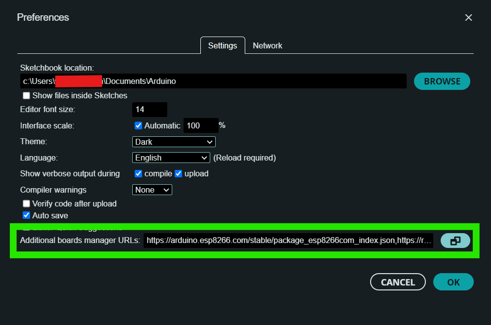
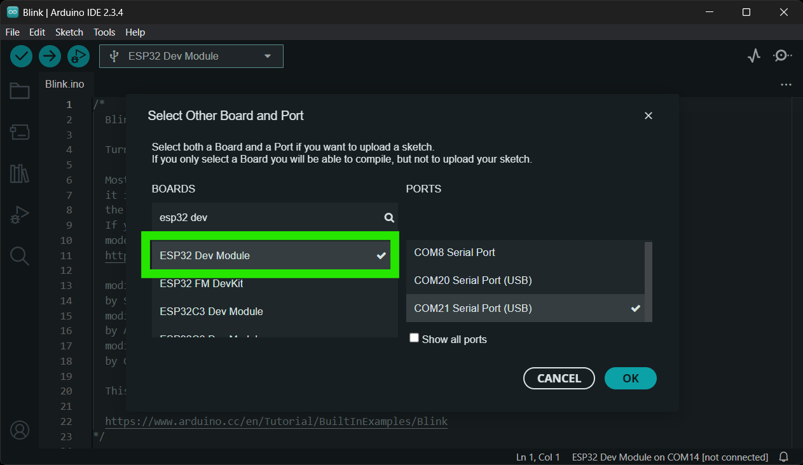

## CH342 USB Driver
The USB drivers for the CH342 USB-to-Serial converter can be downloaded from the [manufacturer's website](https://www.wch-ic.com/search?q=CH342&t=downloads).

<div class="grid cards" align="center" markdown>

-   :material-microsoft-windows: **Windows**

	---

	[:octicons-download-16:{ .heart } Download Page for `CH343SER.EXE`](https://www.wch-ic.com/downloads/CH343SER_EXE.html){ .md-button .md-button--primary target="blank" }


-   :material-apple: **MacOS**

	---

	[:octicons-download-16:{ .heart } Download Page for `CH341SER_MAC.ZIP`](https://www.wch-ic.com/downloads/CH34XSER_MAC_ZIP.html){ .md-button .md-button--primary target="blank" }


</div>


!!! info "Linux"
	A USB driver is not required for Linux based operating systems.


## RTK Everywhere Firmware
The RTK Postcard comes preloaded with our latest [RTK Everywhere firmware](https://github.com/sparkfun/SparkFun_RTK_Everywhere_Firmware). Our firmware is completely open-source; therefore, users can view the code to troubleshoot issues, contribute new features or updates, and file issues for any bugs they discover. In addition, we also users with pre-compiled binaries in our [SparkFun RTK Everywhere Firmware binaries GitHub repository](https://github.com/sparkfun/SparkFun_RTK_Everywhere_Firmware_Binaries) and a [RTK Firmware Uploader](https://github.com/sparkfun/SparkFun_RTK_Firmware_Uploader) tool to upload the pre-compiled binaries to the RTK Postcard. For more information, users can reference the [user manual](http://docs.sparkfun.com/SparkFun_RTK_Everywhere_Firmware/) for the RTK Everywhere firmware and associated links below:

- [Compile the firmware](https://docs.sparkfun.com/SparkFun_RTK_Everywhere_Firmware/firmware_compile/)
- [Update the firmware](https://docs.sparkfun.com/SparkFun_RTK_Everywhere_Firmware/firmware_update_esp32/)
- [RTK Firmware Uploader](https://github.com/sparkfun/SparkFun_RTK_Firmware_Uploader)


`RTK_Everywhere_Firmware_RC-XXX_XX_XXXX.bin`
`RTK_Everywhere_Firmware_RC-*.bin`


## Arduino IDE
Most users may already be familiar with the Arduino IDE and its use. However, for those of you who have never heard the name *Arduino* before, feel free to check out the [Arduino website](https://www.arduino.cc/en/Guide/HomePage). In order to program the RTK Postcard, users will need to install the [ESP32 Arduino Core](https://github.com/espressif/arduino-esp32) through the **Board Manager**. Additionally, we also recommend installing the [SparkFun LG290P Quadband RTK GNSS Arduino Library](https://github.com/sparkfun/SparkFun_LG290P_GNSS_Arduino_Library) to interface with the LG290P GNSS receiver.


### Espressif ESP32 Arduino Core
The [ESP32 Arduino Core](https://github.com/espressif/arduino-esp32) can be installed from the board manager in the Arduino IDE by searching for:

	esp32 by Espressif Systems

<div class="grid" markdown>

<div markdown>

<figure markdown>
[{ width="325" }](./assets/img/hookup_guide/arduino-preferences.png)
<figcaption markdown>
Preference settings for the Arduino IDE.
</figcaption>
</figure>

</div>


<div markdown>

<figure markdown>
[{ width="400" }](./assets/img/hookup_guide/arduino-board_manager.png)
<figcaption markdown>
The Espressif ESP32 Arduino core in the library manager of the Arduino IDE.
</figcaption>
</figure>

</div>

</div>


!!! tip "Arduino Board Manager URL"
	In order to install Espressif's ESP32 Arduino core, users must provide the Arduino Board Manager URL in the preferences settings *(**File** > **Preferences**)* for the Arduino IDE:

	```
	https://raw.githubusercontent.com/espressif/arduino-esp32/gh-pages/package_esp32_index.json
	```


#### Board Selection
In order to program the ESP32 Pico-Mini module on the RTK Postcard, users should select the **ESP32 Dev Module** from the **Tools** > **Board:** > **esp32** drop-down menu.

<figure markdown>
[{ width="400" }](./assets/img/hookup_guide/arduino-select_board.png)
<figcaption markdown>
Selecting the **ESP32 Dev Module** board for the RTK Postcard in the Arduino IDE.
</figcaption>
</figure>


### SparkFun LG290P Quadband RTK GNSS Arduino Library
The [SparkFun LG290P Quadband RTK GNSS Arduino Library](https://github.com/sparkfun/SparkFun_LG290P_GNSS_Arduino_Library) can be installed from the library manager in the Arduino IDE by searching for:

	SparkFun LG290P Quadband RTK GNSS Arduino Library

<div class="grid" markdown>

<div markdown>

<figure markdown>
[{ width="400" }](./assets/img/hookup_guide/arduino-library_manager.png)
<figcaption markdown>
SparkFun LG290P Quadband RTK GNSS Arduino Library in the library manager of the Arduino IDE.
</figcaption>
</figure>

</div>


<div markdown>

!!! tip "Manually Download the Arduino Library"
	For users who would like to manually download and install the library, the `*.zip` file can be accessed from the [GitHub repository](https://github.com/sparkfun/SparkFun_LG290P_GNSS_Arduino_Library) or downloaded by clicking the button below.

	<article style="text-align: center;" markdown>
	[:octicons-download-16:{ .heart } Download the Arduino Library](https://github.com/sparkfun/SparkFun_LG290P_GNSS_Arduino_Library/archive/refs/heads/main.zip){ .md-button .md-button--primary }
	</article>

</div>

</div>
