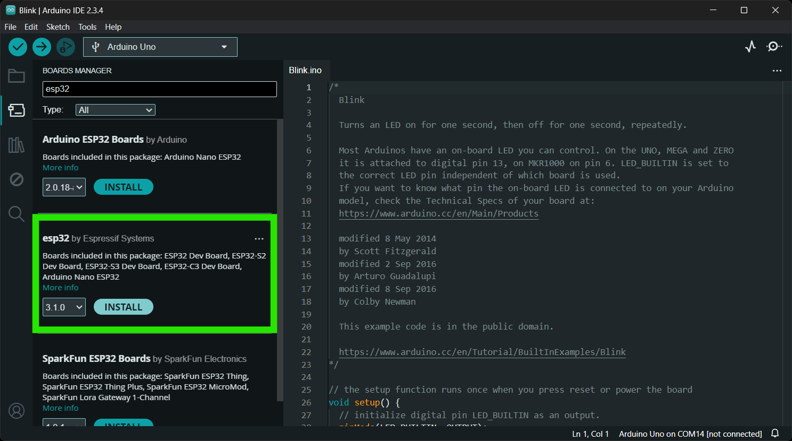

## CH342 USB Driver
The USB drivers for the CH342 USB-to-Serial converter can be downloaded from the [manufacturer's website](https://www.wch-ic.com/search?q=CH342&t=downloads).

<div class="grid cards" align="center" markdown>

-   :material-microsoft-windows: **Windows**

	---

	[:octicons-download-16:{ .heart } Download Page for `CH343SER.EXE`](https://www.wch-ic.com/downloads/CH343SER_EXE.html){ .md-button .md-button--primary target="blank" }


-   :material-apple: **MacOS**

	---

	[:octicons-download-16:{ .heart } Download Page for `CH341SER_MAC.ZIP`](https://www.wch-ic.com/downloads/CH34XSER_MAC_ZIP.html){ .md-button .md-button--primary target="blank" }


</div>


!!! info "Linux"
	A USB driver is not required for Linux based operating systems.


## RTK Everywhere Firmware
The RTK Postcard comes preloaded with our latest [RTK Everywhere firmware](https://github.com/sparkfun/SparkFun_RTK_Everywhere_Firmware). Our firmware is completely open-source; therefore, users can view the code to troubleshoot issues, contribute new features or updates, and file issues for any bugs they discover. In addition, we also users with pre-compiled binaries in our [SparkFun RTK Everywhere Firmware binaries GitHub repository](https://github.com/sparkfun/SparkFun_RTK_Everywhere_Firmware_Binaries) and a [RTK Firmware Uploader](https://github.com/sparkfun/SparkFun_RTK_Firmware_Uploader) tool to upload the pre-compiled binaries to the RTK Postcard. For more information, users can reference the [user manual](http://docs.sparkfun.com/SparkFun_RTK_Everywhere_Firmware/) for the RTK Everywhere firmware and associated links below:

- [Compile the firmware](https://docs.sparkfun.com/SparkFun_RTK_Everywhere_Firmware/firmware_compile/)
- [Update the firmware](https://docs.sparkfun.com/SparkFun_RTK_Everywhere_Firmware/firmware_update_esp32/)
- [RTK Firmware Uploader](https://github.com/sparkfun/SparkFun_RTK_Firmware_Uploader)


## QGNSS Software
QGNSS is highly intuitive GNSS evaluation software that is easy to use, personalized, and compatible with leading Quectel technologies. The software allows users to define or apply GNSS product configurations for specific use cases. Saving, restoring, or sharing configurations between different products and updating the module's firmware are easy. The software supports product evaluation with a choice of views to observe static and dynamic behavior of the connected a Quectel GNSS receiver.

<article style="text-align: center;" markdown>
[:octicons-download-16:{ .heart } Download the QGNSS Software *(v2.x)* from Quectel](https://www.quectel.com/download/qgnss_v2-0_en/){ .md-button .md-button--primary target="blank" }
</article>

??? warning "Windows Only"
	Currently, the QGNSS software is only available for Windows operating systems.


### Connecting to the LG290P
In order to connect to the LG290P properly, users will need to specify the settings of the UART port.

<figure markdown>
[{ width="400" }](./assets/img/hookup_guide/qgnss-uart_settings-button.png "Click to enlarge")
<figcaption markdown>
Click the <kbd>:material-cog:</kbd> button to configure the UART settings.
</figcaption>
</figure>

Before users can connect to the RTK Postcard, they will need to specify the connection settings in QGNSS. Once configured, users can select the ++"OK"++ button and QGNSS will automatically attempt to connect to the GNSS module.

- Select the `LG290P(03)` from the drop-down menu to configure the `Model` of the GNSS module being connected.
- Below, is a list of the default settings for `UART` ports of the LG290P. These settings should be selected in the `Device Information` menu, unless configured differently.
- When connecting through the USB-C connector, under the `Port` option, select the port labeled with channel `B` from the drop-down menu.


<div class="grid" markdown>

<div markdown>

<figure markdown>
[{ width="400" }](./assets/img/hookup_guide/qgnss-uart_settings.png "Click to enlarge")
<figcaption markdown>
From the available `COM` ports for the CH342, select the port labeled `B` to access the LG290P GNSS receiver. Users will also need to specify the settings for the UART port.
</figcaption>
</figure>

</div>


<div markdown>

!!! info "LG290P - Default Settings"
	The UART ports of the LG290P GNSS module will have the following default configuration:

	- Baudrate: 460800bps
	- Data Bits: 8
	- Parity: No
	- Stop Bits: 1
	- Flow Control: None

</div>

</div>


## Arduino IDE
!!! tip
	For first-time users, who have never programmed before and are looking to use the Arduino IDE, we recommend beginning with the <a href="https://www.sparkfun.com/sparkfun-inventor-s-kit-for-arduino-uno-v4-1.html">SparkFun Inventor's Kit (SIK)</a>, which is designed to help users get started programming with the Arduino IDE.

Most users may already be familiar with the Arduino IDE and its use. However, for those of you who have never heard the name *Arduino* before, feel free to check out the [Arduino website](https://www.arduino.cc/en/Guide/HomePage). To get started with using the Arduino IDE, check out our tutorials below:


<div class="grid cards" markdown align="center">

-   <a href="https://learn.sparkfun.com/tutorials/50"><figure markdown>
	
	</figure>

	---

	**What is an Arduino?**</a>

-   <a href="https://learn.sparkfun.com/tutorials/61"><figure markdown>
	
	</figure>

	---

	**Installing the Arduino IDE**</a>

-   <a href="https://learn.sparkfun.com/tutorials/1265"><figure markdown>
	
	</figure>

	---

	**Installing Board Definitions in the Arduino IDE**</a>

-   <a href="https://learn.sparkfun.com/tutorials/15"><figure markdown>
	
	</figure>

	---

	**Installing an Arduino Library**</a>

</div>


### Espressif ESP32 Arduino Core
The [ESP32 Arduino Core](https://github.com/espressif/arduino-esp32) can be installed from the board manager in the Arduino IDE by searching for:

	esp32 by Espressif Systems

<div class="grid" markdown>

<div markdown>

<figure markdown>
[{ width="400" }](./assets/img/hookup_guide/arduino-board_manager.png)
<figcaption markdown>
The Espressif ESP32 Arduino core in the library manager of the Arduino IDE.
</figcaption>
</figure>

</div>


<div markdown>

!!! tip "Arduino Board Manager URL"
	In order to install Espressif's ESP32 Arduino core, users must provide the Arduino Board Manager URL in the preferences settings *(**File** > **Preferences**)* for the Arduino IDE:

	```
	https://raw.githubusercontent.com/espressif/arduino-esp32/gh-pages/package_esp32_index.json
	```


!!! tip "Board Definition for RTK Postcard"
	In order to program the ESP32 Pico-Mini module on the RTK Postcard, users should select the **ESP32 Dev Module** from the **Tools** > **Board:** > **esp32** drop-down menu.


</div>

</div>


### SparkFun LG290P Quadband RTK GNSS Arduino Library
The [SparkFun LG290P Quadband RTK GNSS Arduino Library](https://github.com/sparkfun/SparkFun_LG290P_GNSS_Arduino_Library) can be installed from the library manager in the Arduino IDE by searching for:

	SparkFun LG290P Quadband RTK GNSS Arduino Library

<div class="grid" markdown>

<div markdown>

<figure markdown>
[{ width="400" }](./assets/img/hookup_guide/arduino-library_manager.png)
<figcaption markdown>
SparkFun LG290P Quadband RTK GNSS Arduino Library in the library manager of the Arduino IDE.
</figcaption>
</figure>

</div>


<div markdown>

!!! tip "Manually Download the Arduino Library"
	For users who would like to manually download and install the library, the `*.zip` file can be accessed from the [GitHub repository](https://github.com/sparkfun/SparkFun_LG290P_GNSS_Arduino_Library) or downloaded by clicking the button below.

	<article style="text-align: center;" markdown>
	[:octicons-download-16:{ .heart } Download the Arduino Library](https://github.com/sparkfun/SparkFun_LG290P_GNSS_Arduino_Library/archive/refs/heads/main.zip){ .md-button .md-button--primary }
	</article>

</div>

</div>
